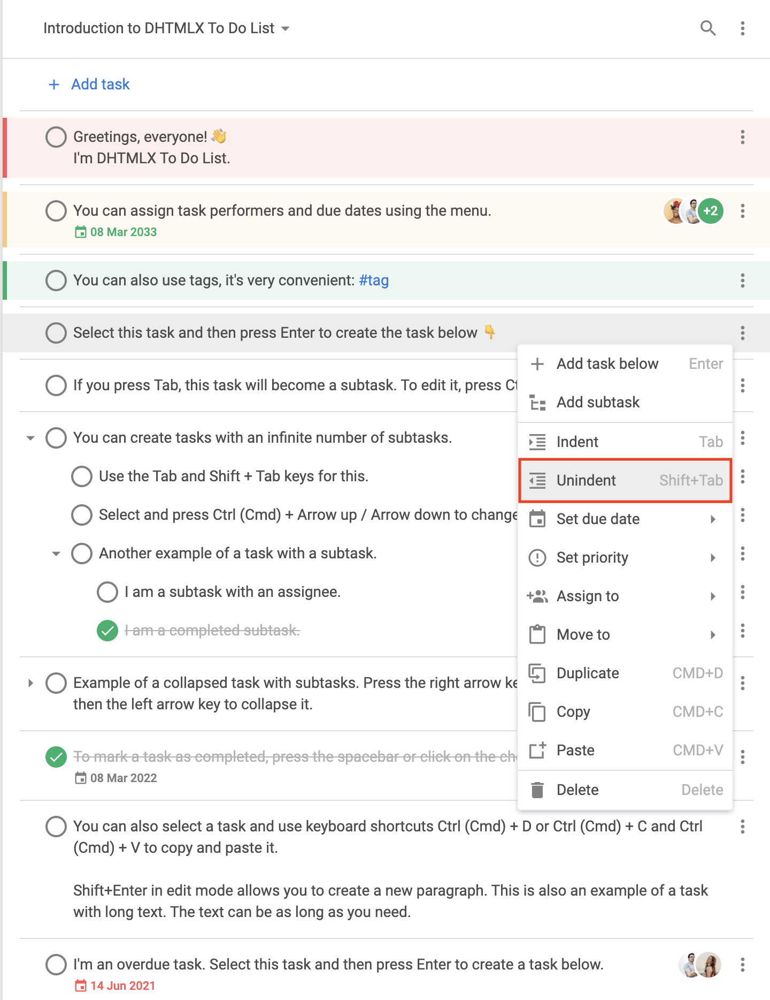
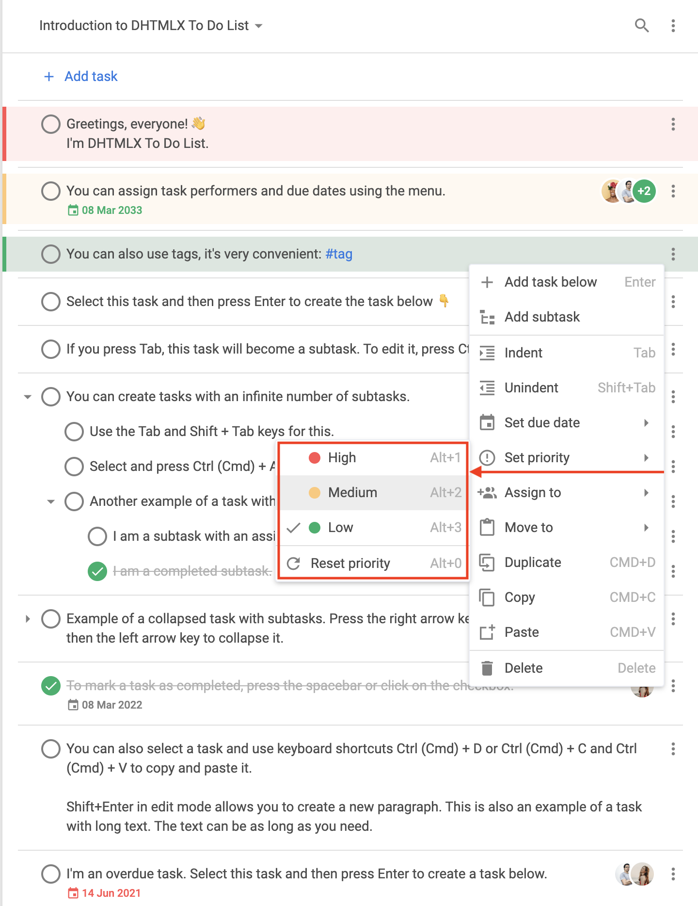
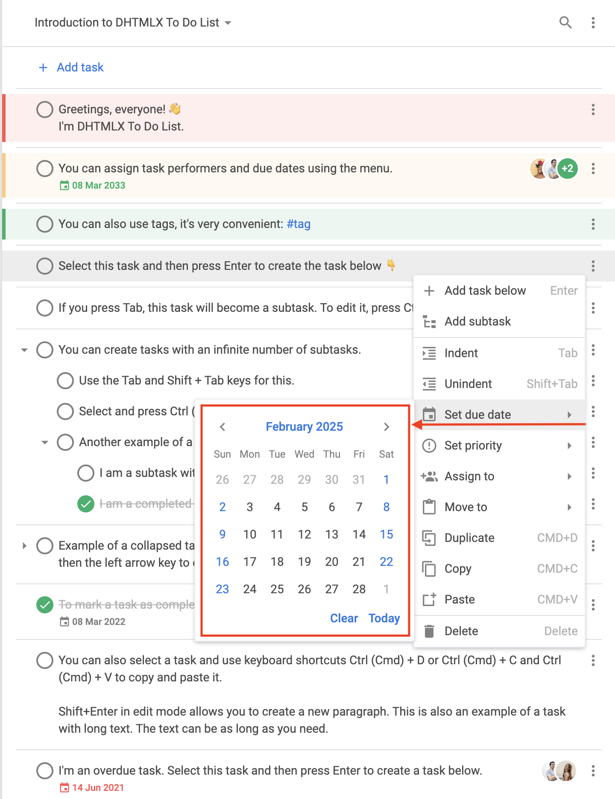
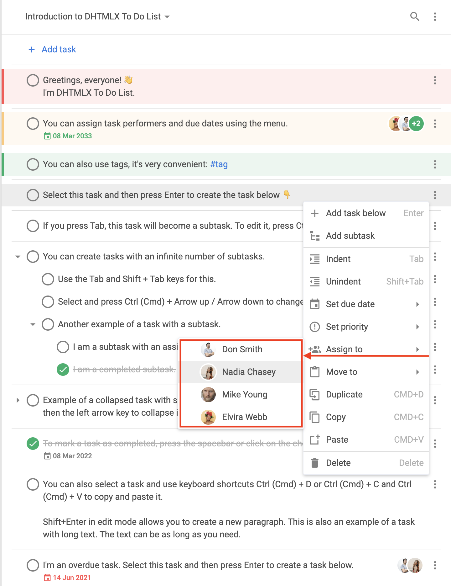

# menu

### Description

@short: Optional. Specifies the context menu visibility (if boolean) or configuration parameters (if function)

### Usage

~~~js
menu?: boolean; 
// or
menu?: function(config: object);
~~~

#### Show or Hide Context Menu

If you want to *hide* the context menu, set the `menu` config to `false`. To make the default context menu visible, set the `menu` config to `true`.

~~~js
menu: true // display the default context menu

// or

menu: false // hide the context menu
~~~

#### Modify Context Menu

If you want to *modify* a context menu, set the `menu` config to a callback that takes the `config` object as a parameter. The `config` object may have the following structure:

~~~js
config: {
    store: object,
    type: "user" | "toolbar" | "task",
    id?: string | number,
    source?: (string | number)[]
};
~~~

**Parameters**

The `config` object may include the following parameters:

- `store` - (required) the readonly DataStore, that should be passed to the `getMenuOptions()` method
- `type` - (required) the type of the context menu. Here you can specify one of the following values:
    - `"user"` - the context menu related to users
    - `"toolbar"` - the context menu related to toolbar
    - `"task"` - the context menu related to tasks
- `id` - (optional|required) the ID of the project. This parameter is required if `type: "toolbar"`
- `source` - (optional|required) an array that include the IDs of tasks. This parameter is required if `type: "task"`

**Returns**

The callback should return one of the following values:

- `boolean` - `true` to display a default context menu; `false` to hide context menu
- `object[]` - the array of objects that store data for context menu items. Each object may have the following structure:

    ~~~js
    {
        id: string | number,
        icon?: string,
        label?: string,
        hotkey?: string,
        value?: Date,
        data?: object[],
        handler?: function,
        css?: string,
        type?: string,
    }
    ~~~

    - `id` - (required) the ID of the menu item
    - `icon` - (optional) the icon for the menu item (by default taken from the **wxi** font)
    - `label` - (optional) the text for the menu item
    - `hotkey` - (optional) a hotkey for the action from this menu item
    - `value` - (optional) the due date, valid for "datepicker"
    - `data` - (optional) the array of objects that store subitems of the menu item
    - `handler` - (optional) the handler that allows you to perform an action for a custom menu item
    - `css` - (optional) the css class
    - `type` - (optional) the menu item type. Here you can specify the following types:
        - `"item"` - the basic menu item

        

        
The **"item"** type default structure

            ~~~js {2}
            {
                type: "item",
                id: string,
                icon: string,
                label: string,
                hotkey: string,
                data: [ // if required
                    // ... same objects for sub-items
                ]
            }
            ~~~
            
        

        - `"separator"` - the line for separating menu items

        

        
The **"separator"** type default structure

            ~~~js
            { type: "separator" }
            ~~~
        

        - `"priority"` - the menu item intended for setting priorities

        

        
The **"priority"** type default structure

        By default, there are **High**, **Medium**, and **Low** items displayed in the submenu of the `"setPriority"` item.

        ~~~js {2,10,18}
        {   // High priority
            type: "priority",
            label: "High",
            color: "#ff5252",
            hotkey: "Alt+1",
            icon: "empty",
            id: "priority:1"
        },
        {   // Medium priority
            type: "priority",
            label: "Medium",
            color: "#ffc975",
            hotkey: "Alt+2",
            icon: "empty",
            id: "priority:2"
        },
        {   // Low priority
            type: "priority",
            label: "Low",
            color: "#0ab169",
            hotkey: "Alt+3",
            icon: "empty",
            id: "priority:3"
        }
        ~~~

        
        

        - `"datepicker"` - the menu item intended for setting dates

        

        
The **"datepicker"** type default structure

        By default, the **"datepicker"** item displayed in the submenu of the `"setDate"` item.

        ~~~js {2}
        {
            type: "datepicker",
            id: "dueDate", // default ID
            value: new Date(), // selected date
            state: object // readonly
        }
        ~~~

        
        

        - `"user"` - the menu item intended for assigning users to tasks

        

        
The **"user"** type default structure

        ~~~js {2}
        {
            type: "user",
            id: string, 
            label: string,
            avatar: string, // the path to the user avatar
            color: string, // the color for the automatic avatar if the link to the picture is not provided, default color is "#0AB169"
            icon: string, // the icon displayed to the left of the avatar and marks the user as assigned
            clickable: boolean, // the value that marks the item as clickable
            checked: boolean // the value that marks the user that this option represents as assigned
        }
        ~~~

        
        

### Example

~~~js {3-66,72}
const { Toolbar, getMenuOptions } = todo;

const menu = function (config) {
    let options = getMenuOptions(config);

    const { source, store, type } = config;
    if (type === "task") {
        // leaving only some of the default menu options
        options = options.filter(o => {
            return (
                o.id == "addSubtask" ||
                o.id == "setDate" ||
                o.id == "setPriority" || 
                o.id == "assign"
            );
        });
        // adding new menu options
        options.push({ type: "separator" });
        options.push({
            type: "item",
            icon: "calendar",
            label: "Add current date",
            id: "addDate",
            handler: () => {
                source.forEach(id => {
                    list.updateTask({
                        id,
                        task: {
                            due_date: new Date(),
                        },
                    });
                });
            },
        });
        const task = store.getTask(source[0]);
        if (task.checked) {
            options.push({
                type: "item",
                icon: "undo",
                label: "Mark incomplete",
                id: "uncheck",
                handler: () => {
                    list.uncheckTask({
                        id,
                    });
                },
            });
        } else {
            options.push({
                type: "item",
                icon: "check",
                label: "Complete",
                id: "check",
                handler: () => {
                    source.forEach(id => {
                        list.checkTask({
                            id,
                        });
                    });
                },
            });
        }
    }

    return options;
};

const list = new ToDo("#root", {
    tasks,
    users,
    projects,
    menu
});
~~~

**Related samples:**
    - [To do list. Menu customization. Adding and removing options](https://snippet.dhtmlx.com/slpjstbb)
    - [To do list. Menu customization. Custom icons](https://snippet.dhtmlx.com/cmfqmg00)
    - [To do list. Remove menu for specific part of interface](https://snippet.dhtmlx.com/5pnk7y0d)
