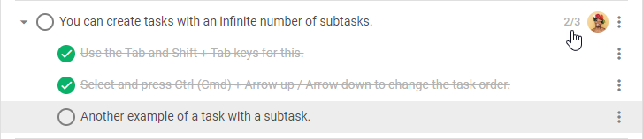
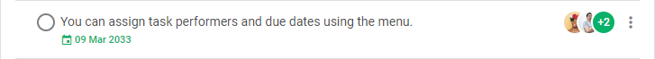
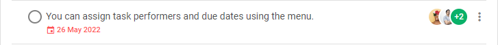
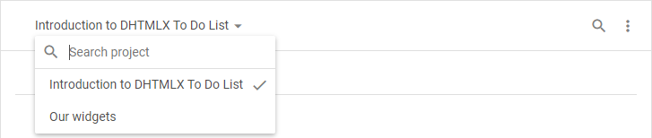

# Configuration

You can adjust the settings of DHTMLX To Do List according to your needs. The available configuration options allow you:
- to configure the appearance of the badge displayed the progress of task completion.
- to configure the format of dates
- to disable validation for due dates of tasks
- to change the mode used for marking tasks done
- to configure the appearance of the toolbar

You can also initialize To Do List in the readonly mode, if needed.

## Tasks

### Counter of completed subtasks

You can change the type of the counter which renders the completion of the child tasks.

By default, each parent task is equipped with the counter whose value is shown as a ratio of completed child tasks and the total number of the child tasks.

If you want the value of the counter to be displayed as a percentage, specify the *type: "percentage"* attribute inside the **counter** parameter of the [taskShape](api/configs/taskshape_config.md) property:

~~~js {5-9}
const list = new ToDo("#root", {
    tasks,
    users,
    projects,
    taskShape: {
        counter: {
            type: "percentage" // "number" by default
        }
    }
});
~~~

**Related sample:** [To do list. Subtask counter and date format](https://snippet.dhtmlx.com/magidhw8)

### Date format

By default, the To Do List displays dates in the "%d %M %Y" format (it looks like 09 Mar 2033). If you want to specify another format for dates, use the **date** parameter of the [taskShape](api/configs/taskshape_config.md) property:

~~~js {5-10}
const list = new ToDo("#root", {
    tasks,
    users,
    projects,
    taskShape: {
        date: {
            format: "%d/%m/%Y", // "%d %M %Y" by default
            validate: true
        }
    }
});
~~~

**Related sample:** [To do list. Subtask counter and date format](https://snippet.dhtmlx.com/magidhw8)

Check [the list of available characters](api/configs/taskshape_config.md#list-of-characters).

### Due date validation

If you specify a [due date](api/configs/tasks_config.md) for a task, the due date validation will track the completion of the task. The due date of the task has green color until the task becomes Overdue. 

The dates of the  tasks which have not been completed on the due date are highlighted in red.  

This validation works by default.

In case you want to disable this functionality, specify the **validation** parameter of the [taskShape](api/configs/taskshape_config.md) property to *false*:

~~~js {5-10}
const list = new ToDo("#root", {
    tasks,
    users,
    projects,
    taskShape: {
        date: {
            format: "%d %M %Y",
            validate: false // true by default
        }
    }
});
~~~

In this configuration, the due dates will be colored grey.

### Mode of marking tasks complete

By default, the process of checking/unchecking tasks is implemented in the "auto" mode, namely:

- If you mark all children of a task as completed, the parent task automatically becomes marked as completed 
- If you mark the parent task as completed, all its child automatically become marked as completed
- If you mark at least one child of a completed task as uncompleted, the task automatically becomes marked as uncompleted
- If you mark the parent task as uncompleted, all its child automatically become uncompleted

You can disable this behavior and activate the "manual" mode. For that, apply the **behavior: "manual"** setting of the **selectable** parameter of the [taskShape](api/configs/taskshape_config.md) property:

~~~js {5-9}
const list = new ToDo("#root", {
    tasks,
    users,
    projects,
    taskShape: {
        selectable: {
            behavior: "manual" // "auto" by default
        }
    }
});
~~~

**Related sample:** [To do list. Two variants of marking a parent task done](https://snippet.dhtmlx.com/5892fcr2)

## Toolbar

The toolbar is a top part of To Do List which is [initialized](guides/initialization.md#initialize-toolbar) and [configured](category/toolbar-properties.md) separately from To Do List.

By default, there are the following controls in the toolbar:

- the **"combo"** control which allows you to switch between projects or search for the necessary ones
- the **"search"** control which provides the search bar
- the **"menu"** control which allows you to add, remove, or delete a project

To adjust the structure of the toolbar, use the [items](api/toolbar_api/configs/items_config.md) configuration property of the Toolbar component. 

~~~js
const toolbar = new Toolbar("#toolbar", {
    api: list.api,
    items: ["search", "combo"]
});
~~~

The property allows you to define which controls should be shown or hidden. Besides, you can enumerate the controls in the **items** array in the order you want to show them in the toolbar.

## Read-only mode

Read the details on how to make the To Do List read-only in the [related section](guides/readonly_mode.md).
