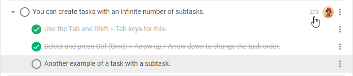
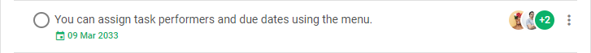
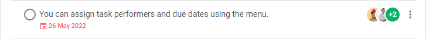

# Configuration

Configure DHTMLX To Do List to match your application's requirements. The following sections cover the available configuration options:

- [Configure the subtask counter](#configure-the-subtask-counter) — configure the badge that shows task completion progress
- [Configure the date format](#configure-the-date-format) — configure the format of dates
- [Configure drag-n-drop](#configure-drag-n-drop) — configure or disable drag-n-drop of tasks
- [Configure due date validation](#configure-due-date-validation) — disable validation for due dates
- [Set the task completion mode](#set-the-task-completion-mode) — change the mode used for marking tasks done
- [Configure the Toolbar](#configure-the-toolbar) — configure the toolbar appearance

See also: [hide completed tasks](#hide-completed-tasks) and [read-only mode](#read-only-mode).

## Tasks

Use the [`taskShape`](api/configs/taskshape_config.md) property to configure the appearance and behavior of tasks.

### Configure the subtask counter

Use the `counter` parameter of [`taskShape`](api/configs/taskshape_config.md) to change how the widget displays child task completion progress.

By default, each parent task has a counter that shows completed child tasks as a ratio (for example, 2/5). To display the counter as a percentage, set `type` to `"percentage"` in the `counter` parameter:

~~~js {5-9}
const list = new ToDo("#root", {
    tasks,
    users,
    projects,
    taskShape: {
        counter: {
            type: "percentage" // "number" by default
        }
    }
});
~~~

**Related sample:** [To do list. Subtask counter and date format](https://snippet.dhtmlx.com/magidhw8)

### Configure the date format

By default, To Do List displays dates in the `"%d %M %Y"` format (for example, 09 Mar 2033). To use a different format, set the `date` parameter of [`taskShape`](api/configs/taskshape_config.md):

~~~js {5-10}
const list = new ToDo("#root", {
    tasks,
    users,
    projects,
    taskShape: {
        date: {
            format: "%d/%m/%Y", // "%d %M %Y" by default
            validate: true
        }
    }
});
~~~

**Related sample:** [To do list. Subtask counter and date format](https://snippet.dhtmlx.com/magidhw8)

Check [the list of available characters](api/configs/taskshape_config.md#list-of-characters).

### Configure drag-n-drop

To Do List supports drag-n-drop by default. You can [select one or several tasks](../../#selecting-tasks) and drag them vertically at once. To copy the selected tasks, hold the *Alt* key during drag-n-drop.

Use the [`drag`](api/configs/drag_config.md) property to adjust drag-n-drop behavior:

- To prevent collapsed tasks from expanding when hovered during drag-n-drop, set `expand` to `false`:

~~~js {7}
const list = new ToDo("#root", {
    tasks: [
        { id: "1", text: "Task 1 #tag1" },
        ...
    ],
    drag: {
        expand: false // true by default
    }
});
~~~

- To disable drag-n-drop entirely, set `drag` to `false`:

~~~js {6}
const list = new ToDo("#root", {
    tasks: [
        { id: "1", text: "Task 1 #tag1" },
        ...
    ],
    drag: false // true by default
});
~~~

### Configure due date validation

When a task has a [due date](api/configs/tasks_config.md), To Do List tracks its completion status. The due date appears green until the task becomes overdue.

Tasks not completed by the due date are highlighted in red.

Due date validation is active by default. To disable it, set `validate` to `false` in the `date` parameter of [`taskShape`](api/configs/taskshape_config.md):

~~~js {5-10}
const list = new ToDo("#root", {
    tasks,
    users,
    projects,
    taskShape: {
        date: {
            format: "%d %M %Y",
            validate: false // true by default
        }
    }
});
~~~

With validation disabled, due dates appear gray.

### Set the task completion mode

By default, To Do List uses the `"auto"` completion mode:

- Marking all children of a task as completed also marks the parent task as completed.
- Marking the parent task as completed marks all child tasks as completed.
- Marking at least one child of a completed task as uncompleted marks the parent task as uncompleted.
- Marking the parent task as uncompleted marks all child tasks as uncompleted.

To disable this cascade behavior, set `behavior` to `"manual"` in the `completed` parameter of [`taskShape`](api/configs/taskshape_config.md):

~~~js {5-9}
const list = new ToDo("#root", {
    tasks,
    users,
    projects,
    taskShape: {
        completed: {
            behavior: "manual" // "auto" by default
        }
    }
});
~~~

**Related sample:** [To do list. Two variants of marking a parent task done](https://snippet.dhtmlx.com/5892fcr2)

## Configure the Toolbar

The Toolbar is [initialized](guides/initialization.md#initialize-toolbar) and [configured](category/toolbar-properties.md) separately from To Do List.

Use the [`items`](api/toolbar_api/configs/items_config.md) property to define which controls appear in the Toolbar and in what order:

~~~js
const toolbar = new Toolbar("#toolbar", {
    api: list.api,
    items: ["search", "combo"]
});
~~~

Pass control names in the `items` array to show or hide them.

## Hide completed tasks

See the [Hide completed tasks](guides/hide_completed_tasks.md) guide for details.

## Read-only mode

See the [Read-only mode](guides/readonly_mode.md) guide for details.
