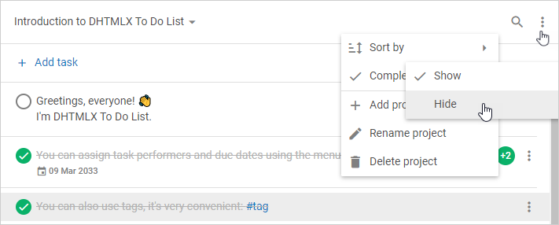

# Show/hide completed tasks

## Initial mode

There are two modes of displaying tasks in To Do List:

- when all tasks are shown on the page (*default*)
- when completed tasks are hidden from the page

You may initialize To Do List in the mode when all completed tasks will be hidden from the page. It will let you focus only on those tasks which yet need to be done. For that, you need to enable the **taskHide** setting of the **completed** parameter of the [`taskShape`](api/configs/taskshape_config.md) property, as in:  

~~~js {6}
const list = new ToDo("#root", {
    tasks,
    taskShape: {
        completed: {
            behavior: "manual",
            taskHide: true
        }
    }
});
~~~

## Switching between modes

You may easily switch between these two modes after initialization of To Do List in two ways:

- via the **Completed tasks -> Show/Hide** menu option of the Toolbar menu

- via the related [hideCompletedTasks()](api/methods/hidecompletedtasks_method.md) and [showCompletedTasks()](api/methods/showcompletedtasks_method.md) methods:

~~~js
list.hideCompletedTasks(); 
// or
list.showCompletedTasks(); 
~~~