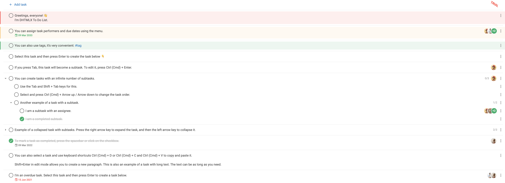

# Integration with Angular

:::tip
You should be familiar with basic concepts and patterns of **Angular** before reading this documentation. To refresh your knowledge, please refer to the [**Angular documentation**](https://angular.io/docs).
:::

DHTMLX To Do List is compatible with **Angular**. We prepared code examples on how to use DHTMLX To Do List with **Angular**. For more information, refer to the corresponding [**Example on GitHub**](https://github.com/DHTMLX/angular-todolist-demo).

## Creating a project

:::info
Before you start to create a new project, install [**Angular CLI**](https://angular.io/cli) and [**Node.js**](https://nodejs.org/en/).
:::

Create a new **my-angular-todo-app** project using Angular CLI. For this purpose, run the following command:

~~~json
ng new my-angular-todo-app
~~~

The command above installs all the necessary tools, so you don't need to run any additional commands.

### Installation of dependencies

Go to the new created app directory:

~~~json
cd my-angular-todo-app
~~~

Install dependencies and start the dev server. For this, use the [**yarn**](https://yarnpkg.com/) package manager:

~~~json
yarn
yarn start
~~~

The app should run on a localhost (for instance `http://localhost:3000`).

## Creating To Do List

Now you should get the DHTMLX To Do List source code. First of all, stop the app and proceed with installing the To Do List package.

### Step 1. Package installation

Download the [**trial To Do List package**](/how_to_start/#installing-to-do-list-via-npm-and-yarn) and follow steps mentioned in the README file. Note that trial To Do List is available 30 days only.
  
### Step 2. Component creation

Now you need to create an Angular component, to add To Do List with Toolbar into the application. Create the **todo** folder in the **src/app/** directory, add a new file into it and name it **todo.component.ts**.

#### Import source files

Open the **todo.component.ts** file and import To Do List source files. Note that:

- if you use PRO version and install the To Do List package from a local folder, the imported path looks like this:

~~~jsx title="todo.components.ts"
import { ToDo, Toolbar } from 'dhx-todolist-package';
~~~

- if you use the trial version of To Do List, specify the following path:

~~~jsx title="todo.components.ts"
import { ToDo, Toolbar } from '@dhx/trial-todolist';
~~~

In this tutorial you can see how to configure the **trial** version of To Do List.

#### Set containers and initialize the To Do List with Toolbar

To display To Do List with Toolbar on the page, you need to set containers for To Do List and Toolbar, and initialize these components using the corresponding constructors:

~~~jsx {1,8-11,15-18,24-31} title="todo.component.ts"
import { ToDo, Toolbar } from '@dhx/trial-todolist'; 
import { Component, ElementRef, OnInit, ViewChild, OnDestroy, ViewEncapsulation} from '@angular/core';

@Component({
    encapsulation: ViewEncapsulation.None,
    selector: "todo", // a template name used in the "app.component.ts" file as <todo />
    styleUrls: ["./todo.component.css"], // include the css file
    template:  `<main class="component_container">
                    

                    

                </main>`
})

export class ToDoComponent implements OnInit, OnDestroy {
    // initialize container for Toolbar
    @ViewChild("toolbar_container", { static: true }) toolbar_container!: ElementRef;
    // initialize container for To Do List 
    @ViewChild("todo_container", { static: true }) todo_container!: ElementRef;
    
    private _todo!: ToDo;
    private _toolbar!: Toolbar;

    ngOnInit() {
        // initialize the To Do List component
        this._todo = new ToDo(this.todo_container.nativeElement, {});
        
        // initialize the Toolbar component
        this._toolbar = new Toolbar(this.toolbar_container.nativeElement, {
            api: this._todo.api,
            // other configuration properties 
        });
    }

    ngOnDestroy(): void {
        this._todo.destructor(); // destruct To Do List
        this._toolbar.destructor(); // destruct Toolbar
    }
}
~~~

#### Loading data

To add data into To Do List, you need to provide a data set. You can create the **data.ts** file in the **src/app/todo/** directory and add some data into it:

~~~jsx {2,19,28,38} title="data.ts"
export function getData() {
    const tasks = [
        {
            id: "temp://1652991560212",
            project: "introduction",
            text: "Greetings, everyone! \u{1F44B} \nI'm DHTMLX To Do List.",
            priority: 1
        },
        {
            id: "1652374122964",
            project: "introduction",
            text: "You can assign task performers and due dates using the menu.",
            assigned: ["user_4", "user_1", "user_2", "user_3"],
            due_date: "2033-03-08T21:00:00.000Z",
            priority: 2
        },
        // ...
    ];
    const users = [
        {
            id: "user_1",
            label: "Don Smith",
            avatar:
                "https://snippet.dhtmlx.com/codebase/data/common/img/02/avatar_61.jpg"
        },
        // ...
    ];
    const projects = [
        {
            id: "introduction",
            label: "Introduction to DHTMLX To Do List"
        },
        {
            id: "widgets",
            label: "Our widgets"
        }
    ];
    return { tasks, users, projects };
}
~~~

Then open the ***todo.component.ts*** file. Import the file with data and specify the corresponding data properties to the configuration object of To Do List within the `ngOnInit()` method, as shown below:

~~~jsx {2,23,25-27} title="todo.component.ts"
import { ToDo, Toolbar } from '@dhx/trial-todolist';
import { getData } from "./data"; // import data
import { Component, ElementRef, OnInit, ViewChild, OnDestroy, ViewEncapsulation} from '@angular/core';

@Component({
    encapsulation: ViewEncapsulation.None,
    selector: "todo", 
    styleUrls: ["./todo.component.css"], 
    template:  `<main class="component_container">
                    

                    

                </main>`
})

export class ToDoComponent implements OnInit, OnDestroy {
    @ViewChild("toolbar_container", { static: true }) toolbar_container!: ElementRef;
    @ViewChild("todo_container", { static: true }) todo_container!: ElementRef;
    
    private _todo!: ToDo;
    private _toolbar!: Toolbar;

    ngOnInit() {
        const { users, tasks, projects } = getData(); // initialize data properties
        this._todo = new ToDo(this.todo_container.nativeElement, {
            users, // apply user data
            tasks, // apply task data
            projects,// apply project data
            // other configuration properties
        });

        this._toolbar = new Toolbar(this.toolbar_container.nativeElement, {
            api: this._todo.api,
            // other configuration properties 
        });
    }

    ngOnDestroy(): void {
        this._todo.destructor();
        this._toolbar.destructor();
    }
}
~~~

You can also use the [`parse()`](/api/methods/parse_method/) method inside the `ngOnInit()` method of Angular to load data into To Do List.

~~~jsx {2,23,31-36} title="todo.component.ts"
import { ToDo, Toolbar } from '@dhx/trial-todolist';
import { getData } from "./data"; // import data
import { Component, ElementRef, OnInit, ViewChild, OnDestroy, ViewEncapsulation} from '@angular/core';

@Component({
    encapsulation: ViewEncapsulation.None,
    selector: "todo", 
    styleUrls: ["./todo.component.css"], 
    template:  `<main class="component_container">
                    

                    

                </main>`
})

export class ToDoComponent implements OnInit, OnDestroy {
    @ViewChild("toolbar_container", { static: true }) toolbar_container!: ElementRef;
    @ViewChild("todo_container", { static: true }) todo_container!: ElementRef;
    
    private _todo!: ToDo;
    private _toolbar!: Toolbar;

    ngOnInit() {
        const { users, tasks, projects } = getData(); // initialize data properties
        this._todo = new ToDo(this.todo_container.nativeElement, {});

        this._toolbar = new Toolbar(this.toolbar_container.nativeElement, {
            api: this._todo.api,
            // other configuration properties 
        });

        // apply the data via the parse() method
        this._todo.parse({ 
            users, 
            tasks, 
            projects 
        }); 
    }

    ngOnDestroy(): void {
        this._todo.destructor();
        this._toolbar.destructor();
    }
}
~~~

The `parse(data)` method provides data reloading on each applied change.

Now the To Do List component is ready to use. When the element will be added to the page, it will initialize the To Do List with data. You can provide necessary configuration settings as well. Visit our [To Do List API docs](/api/overview/configs_overview/) to check the full list of available properties.

#### Handling events

When a user makes some action in the To Do List, it invokes an event. You can use these events to detect the action and run the desired code for it. See the [full list of events](/api/overview/events_overview/).

Open the **todo.component.ts** file and complete the `ngOnInit()` method in the following way:

~~~jsx {5-7} title="todo.component.ts"
// ...
ngOnInit() {
    this._todo = new ToDo(this.todo_container.nativeElement, {});

    this._todo.events.on("add-task", (obj) => {
        console.log("A new task is added", obj);
    });
}

ngOnDestroy(): void {
    this._todo.destructor();
}
~~~

### Step 3. Adding To Do List into the app

To add the ***ToDoComponent*** component into the app, open the ***src/app/app.component.ts*** file and replace the default code with the following one:

~~~jsx {5} title="app.component.ts"
import { Component } from "@angular/core";

@Component({
    selector: "app-root",
    template: `<todo/>` // a template created in the "todo.component.ts" file 
})
export class AppComponent {
    name = "";
}
~~~

Then create the ***app.module.ts*** file in the ***src/app/*** directory and specify the *ToDoComponent* as shown below:

~~~jsx {4-5,8} title="app.module.ts"
import { NgModule } from "@angular/core";
import { BrowserModule } from "@angular/platform-browser";

import { AppComponent } from "./app.component";
import { ToDoComponent } from "./todo/todo.component";

@NgModule({
    declarations: [AppComponent, ToDoComponent],
    imports: [BrowserModule],
    bootstrap: [AppComponent]
})
export class AppModule {}
~~~

The last step is to open the ***src/main.ts*** file and replace the existing code with the following one:

~~~jsx title="main.ts"
import { platformBrowserDynamic } from "@angular/platform-browser-dynamic";
import { AppModule } from "./app/app.module";
platformBrowserDynamic()
    .bootstrapModule(AppModule)
    .catch((err) => console.error(err));
~~~

After that, you can start the app to see To Do List loaded with data on a page.

Now you know how to integrate DHTMLX To Do List with Angular. You can customize the code according to your specific requirements. The final example you can find on [**GitHub**](https://github.com/DHTMLX/angular-todolist-demo).
