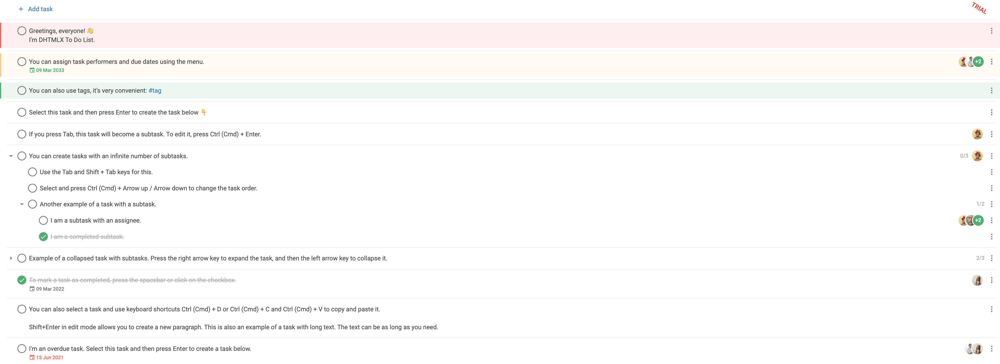

# Integration with Svelte

:::tip
Familiarize yourself with the basic concepts and patterns of **Svelte** before reading this documentation. To refresh your knowledge, refer to the [**Svelte documentation**](https://svelte.dev/docs/svelte/overview).
:::

DHTMLX To Do List is compatible with **Svelte**. The examples below show how to use them together. For a complete project, see the [**example on GitHub**](https://github.com/DHTMLX/svelte-todolist-demo).

## Create a project

Scaffold a new Svelte project and install dependencies.

:::info
Before you create a new project, install [**Vite**](https://vite.dev/) (optional) and [**Node.js**](https://nodejs.org/en/).
:::

Create a **Svelte** project in one of two ways:

- use [**SvelteKit**](https://kit.svelte.dev/)
- use **Svelte with Vite** without SvelteKit

The example below scaffolds a Svelte + Vite project:

~~~bash
npm create vite@latest
~~~

Check the details in the [related article](https://svelte.dev/docs/svelte/overview).

### Install dependencies

Name the project *my-svelte-todo-app* and go to the app directory:

~~~bash
cd my-svelte-todo-app
~~~

Install dependencies and start the dev server with a package manager.

Run the following commands with [**yarn**](https://yarnpkg.com/):

~~~bash
yarn
yarn start
~~~

Run the following commands with [**npm**](https://www.npmjs.com/):

~~~bash
npm install
npm run dev
~~~

The app runs on a localhost address (for example, `http://localhost:3000`).

## Create the To Do List

Stop the app and install the To Do List package.

### Step 1. Install the package

Download the [**trial To Do List package**](/how_to_start/#installing-to-do-list-via-npm-or-yarn) and follow the steps in the README file. The trial version is available for 30 days only.

### Step 2. Create the component

Create a Svelte component to add the To Do List with the Toolbar into the application. In the *src/* directory, add a new file named *ToDo.svelte*.

#### Import source files

Open *ToDo.svelte* and import the To Do List source files. Choose one of two import paths:

- PRO version installed from a local folder — import from `dhx-todolist-package`
- trial version — import from `@dhx/trial-todolist`

The example below imports from the PRO package:

~~~html title="ToDo.svelte"

~~~

Depending on the package, the source files can be minified. Import the CSS file as *todo.min.css* in that case.

The snippet below imports from the trial package:

~~~html title="ToDo.svelte"

~~~

This tutorial uses the **trial** version.

#### Set containers and add the To Do List with Toolbar

To display the To Do List with the Toolbar on the page, create containers for both components and initialize them with the constructors. The example below binds the containers and initializes the components inside `onMount`:

~~~html {3,6,10-11,13-17,27-28} title="ToDo.svelte"

    

    

~~~

#### Load data

Create the *data.js* file in the *src/* directory and add data into it. The following example exports a `getData()` function that returns tasks, users, and projects:

~~~jsx {2,19,28,38} title="data.js"
export function getData() {
    const tasks = [
        {
            id: "temp://1652991560212",
            project: "introduction",
            text: "Greetings, everyone! \u{1F44B} \nI'm DHTMLX To Do List.",
            priority: 1
        },
        {
            id: "1652374122964",
            project: "introduction",
            text: "You can assign task performers and due dates using the menu.",
            assigned: ["user_4", "user_1", "user_2", "user_3"],
            due_date: "2033-03-08T21:00:00.000Z",
            priority: 2
        },
        // ...
    ];
    const users = [
        {
            id: "user_1",
            label: "Don Smith",
            avatar:
                "https://snippet.dhtmlx.com/codebase/data/common/img/02/avatar_61.jpg"
        },
        // ...
    ];
    const projects = [
        {
            id: "introduction",
            label: "Introduction to DHTMLX To Do List"
        },
        {
            id: "widgets",
            label: "Our widgets"
        }
    ];
    return { tasks, users, projects };
}
~~~

Open *App.svelte*, import the data, and pass it into the `<ToDo/>` component as **props**:

~~~html {3,5,8} title="App.svelte"

<ToDo {users} {tasks} {projects} />
~~~

Go to *ToDo.svelte* and apply the passed **props** to the To Do List configuration object. The snippet below passes user, task, and project data through configuration:

~~~html {6-8,15-17} title="ToDo.svelte"

    

    

~~~

You can also use the [`parse()`](api/methods/parse_method.md) method inside `onMount()` to load data into the To Do List. The example below loads data with `parse()` after initialization:

~~~html {6-8,21} title="ToDo.svelte"

    

    

~~~

Each call to `parse(data)` replaces the current dataset.

The component now renders a populated To Do List. See the [configuration overview](api/overview/configs_overview.md) for other available properties.

#### Handle events

Subscribe to events to react to user actions. See the [full list of events](api/overview/events_overview.md).

Open *ToDo.svelte* and complete the `onMount()` method. The snippet below attaches a handler to the `add-task` event:

~~~html {8-10} title="ToDo.svelte"

// ...
~~~

### Step 3. Add the To Do List into the app

To add the component into the app, open *App.svelte* and replace the default code with the following snippet:

~~~html title="App.svelte"

<ToDo {users} {tasks} {projects} />
~~~

Start the app — the To Do List renders with sample data:

Find the complete project on [**GitHub**](https://github.com/DHTMLX/svelte-todolist-demo).
