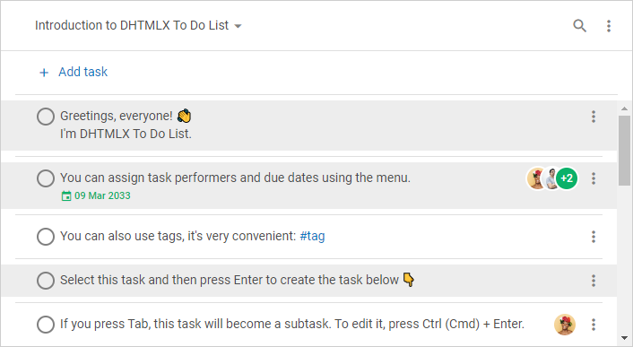

# Multiple select and bulk operations

The To Do List library allows you to select multiple tasks and manage them at once.

In this article we'll discuss the details on how to initialize To Do List with selected tasks, how to select one or several tasks after the initialization stage, how to get IDs of all selected tasks. 

We'll consider how to perform bulk operations over the selected tasks and provide you with a list of available operations. And, finally, we'll show you the ways of resetting selection.

:::info
Learn how to [select](../../#selecting-tasks) and [manage multiple tasks](../../#managing-multiple-tasks) via UI
:::

## Initially selected tasks

If you want to create a To Do List with initially selected tasks, use the [`selected`](api/configs/selected_config.md) configuration property of To Do List:

~~~js {12}
const list = new ToDo("#root", {
	tasks: [
        { id: "1", text: "Task 1" },
		{ id: "1.1", text: "Task 1.1", parent: "1" },
        { id: "1.1.1", text: "Task 1.1.1", parent: "1.1" },
		{ id: "1.2", text: "Task 1.2", parent: "1" },
        { id: "2", text: "Task 2" },
		{ id: "2.1", text: "Task 2.1", parent: "2" },
        { id: "2.1.1", text: "Task 2.1.1", parent: "2.1" },
		{ id: "2.2", text: "Task 2.2", parent: "2" },
    ],
    selected: ["1.1", "1.2", "2.2"],
});

console.log(list.getSelection()); // ["1.1", "1.2", "2.2"]
~~~

## Selecting tasks

The library provides you with the [`selectTask()`](api/methods/selecttask_method.md) method which lets you select tasks after To Do List initialization. The method has two parameters:

- `id` - the ID of the task to select
- `join` - defines whether To Do List should join the specified task to the previously selected tasks

### Selecting one task

By default, the value of the **join** parameter is set to *false*. It means, that the method will select only the specified task without saving IDs of the previously selected tasks.

Take a look at the following code snippet:

~~~js {19}
const list = new ToDo("#root", {
	tasks: [
        { id: "1", text: "Task 1" },
		{ id: "1.1", text: "Task 1.1", parent: "1" },
        { id: "1.1.1", text: "Task 1.1.1", parent: "1.1" },
		{ id: "1.2", text: "Task 1.2", parent: "1" },
        { id: "2", text: "Task 2" },
		{ id: "2.1", text: "Task 2.1", parent: "2" },
        { id: "2.1.1", text: "Task 2.1.1", parent: "2.1" },
		{ id: "2.2", text: "Task 2.2", parent: "2" },
    ],
    selected: ["1.1", "1.2", "2.2"],
});

console.log(list.getSelection()) // ["1.1", "1.2", "2.2"]

list.selectTask({ 
    id: "2.1", 
    join: false // resets selection of previously selected tasks
});

console.log(list.getSelection()) // ["2.1"]
~~~

### Selecting multiple tasks

In order to select multiple tasks, you need to set the value of the **join** parameter to *true*. In this case, the `selectTask()` method will select the specified task and will not reset selection of earlier selected tasks.

The most convenient way to select several tasks at once is shown below:

~~~js {14-18}
const list = new ToDo("#root", {
	tasks: [
        { id: "1", text: "Task 1" },
		{ id: "1.1", text: "Task 1.1", parent: "1" },
        { id: "1.1.1", text: "Task 1.1.1", parent: "1.1" },
		{ id: "1.2", text: "Task 1.2", parent: "1" },
        { id: "2", text: "Task 2" },
		{ id: "2.1", text: "Task 2.1", parent: "2" },
        { id: "2.1.1", text: "Task 2.1.1", parent: "2.1" },
		{ id: "2.2", text: "Task 2.2", parent: "2" },
    ]
});

const selected = ["1.1", "1.2", "2.2"];

for (id of selected) {
    list.selectTask({ id, join: true });
}

console.log(list.getSelection()) // ["1.1", "1.2", "2.2"]
~~~

And here is an example of how you can select one more task:

~~~js {3}
console.log(list.getSelection()) // ["1.1", "1.2", "2.2"]

list.selectTask({ id: "2.1", join: true });

console.log(list.getSelection()) // ["1.1", "1.2", "2.2", "2.1"]
~~~

## Getting all selected tasks

To get all tasks that are currently selected, use the [`getSelection()`](api/methods/getselection_method.md) method:

~~~js
// sorted - disable;
list.getSelection({ sorted: false }); // ["1.2", "1.1", "2.2", "2.1"]

// sorted - enable;
list.getSelection({ sorted: true }); // ["1.1", "1.2", "2.1", "2.2"]
~~~

Enable the **sorted** parameter if you need to get IDs of the selected tasks in the order they are displayed in List.

## Managing selected tasks

After you have selected multiple tasks, you may apply different operations to them at once. 

For this purpose, the library includes the [`eachSelected()`](api/methods/eachselected_method.md) method that allows iterating over all selected tasks. The additional parameters of the method - **sorted** and **reversed** - let you define whether the tasks should be sorted or not and specify the direction of iteration.

For example, you can apply the method to delete all selected tasks:

~~~js
list.eachSelected(id => {
    list.deleteTask({ id });
}, true);
~~~

Check the full list of available operations you can perform over multiple tasks [below](#list-of-available-operations).

### List of available operations

Here is the full list of bulk operations you can perform over multiple selected tasks via API methods:

- copying tasks via the [`copyTask()`](../../api/methods/copytask_method/) method
- pasting tasks via the [`pasteTask()`](../../api/methods/pastetask_method/) method
- moving tasks via the [`moveTask()`](../../api/methods/movetask_method/) method
- deleting tasks via the [`deleteTask()`](../../api/methods/deletetask_method/) method
- marking tasks complete/incomplete via the [`checkTask()`](../../api/methods/checktask_method/) and [`uncheckTask()`](../../api/methods/unchecktask_method/) methods
- demoting and promoting the nesting level of tasks via the [`indentTask()`](../../api/methods/indenttask_method/) and [`unindentTask()`](../../api/methods/unindenttask_method/) methods

## Resetting selection

### Unselecting one task

To remove selection from one selected task, pass the ID of the task as a parameter to the [`unselectTask()`](../../api/methods/unselecttask_method/) method:

~~~js
list.unselectTask({ id: "1.1" });
~~~

### Unselecting all tasks

To unselect all currently selected tasks, pass **id: null** to the [`unselectTask()`](../../api/methods/unselecttask_method/) method:

~~~js
list.unselectTask({ id: null });
~~~

