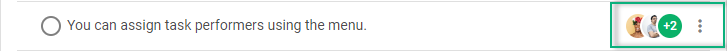

# Task assignees

You can delegate tasks to one or several people.

The list of assignees is specified via the [users](../../api/configs/users_config/) configuration property of To Do List.

~~~js
const users = [
    { id: "user_1", label: "Don Smith", avatar: "../avatar_61.jpg"},
    { id: "user_2", label: "Nadia Chasey", avatar: "../avatar_63.jpg" },
    { id: "user_3", label: "Mike Young", avatar: "../avatar_03.jpg" },
    { id: "user_4", label: "Elvira Webb", avatar: "../avatar_33.jpg" }
];

const list = new ToDo("#root", { users });
~~~

To assign people to the necessary task on the initialization stage, pass the id(s) of the assignees to the **assigned** parameter of the related [task](../../api/configs/tasks_config/) object:

~~~js {6}
const tasks = [
    {
        id: "2",
        project: "introduction",
        text: "You can assign task performers using the menu.",
        assigned: [ "user_1", "user_2", "user_3", "user_4" ],
    }
];

const users = [
    { id: "user_1", label: "Don Smith", avatar: "../avatar_61.jpg"},
    ...
];

const list = new ToDo("#root", {
    tasks,
    users
});
~~~

As a result, the assigned people will be displayed to the right of the task.

To view the list of people assigned to a task, click on the people avatars. To close the opened list, click outside it.

## Assigning/unassigning people

There are two ways to assign/unassign people to a task after initialization of the component:

- via the **Assign to** option of the task menu
- via the corresponding [assignUser()](../../api/methods/assignuser_method/) and [unassignUser()](../../api/methods/unassignuser_method/) methods, for example:

~~~js
// assign a person to the task
list.assignUser({
    id: "3",
    userId: "user_1"
});

// unassign a person from the task
list.unassignUser({
    id: "2",
    userId: "user_1"
});
~~~
