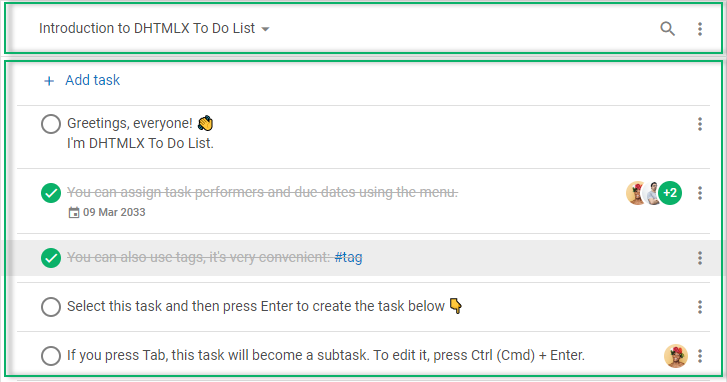

# How to start

This tutorial will teach you how to create a fully featured To Do List and add it into your web application. 

After completing all the steps below, you will get a ready-to-use To Do List which you can easily configure to suite your needs and efficiently use in real life.

## Step 1. Include source files

:::info
Download the To Do List package [**here**](https://dhtmlx.com/docs/products/dhtmlxTodo/download.shtml) and unpack it into a folder of your future project.
:::

At first, create an HTML file and call it *index.html*. Then include the source files of DHTMLX To Do List into this file.

You need to include the following two files:

- the JS file of To Do List
- the CSS file of To Do List

~~~html title="index.html" {5-6}
<!DOCTYPE html>
<html>
    <head>
        <title>How to Start with DHTMLX To Do List</title>
          
        <link rel="stylesheet" href="./dist/todo.css">
    </head>
    <body>
        
    </body>
</html>
~~~

:::info
You can also import To Do List into your project using `yarn` or `npm` commands. To get the trial version of To Do List, run the following commands:

~~~jsx {2-3,6-7}
// npm
npm config set @dhx:registry https://npm.dhtmlx.com
npm i @dhx/trial-todolist

// yarn
yarn config set @dhx:registry https://npm.dhtmlx.com
yarn add @dhx/trial-todolist
~~~

To get To Do List under the proprietary license, refer to **[Support Center](https://dhtmlx.com/docs/technical-support.shtml)**!
:::

:::tip
If you want to integrate JavaScript To Do List into React, Angular or Vue projects, refer to the corresponding [**Examples on CodeSandbox**](https://codesandbox.io/u/DHTMLX) for more information.
:::

## Step 2. Create To Do List

Now you can add a To Do List to the page. For this, you should create two DIV containers to place the To Do List and its Toolbar into. So, your steps are:

- specify two DIV containers in the *index.html* file
- initialize To Do List and its Toolbar via the **new ToDo()** and **new Toolbar()** constructors correspondingly

~~~js title="index.html"
<!DOCTYPE html>
<html>
    <head>
        <title>How to Start with To Do List</title>
          
        <link rel="stylesheet" href="./dist/todo.css">
    </head>
    <body>
        

        

        
    </body>
</html>
~~~

:::note
You should apply the object destructuring to "unpack" the **todo** global object into two variables: ToDo and Toolbar. 

You don't need this step if you use the **new todo.ToDo()** and **new todo.Toolbar()** constructors.
:::

:::info
Toolbar is an optional part of the To Do List interface. To create a To Do List without the Toolbar, you can specify only one DIV container and initialize List via the **new ToDo()** constructor
:::

For more information about initialization of To Do List read the [Initialization](guides/initialization.md) article.

## Step 3. Load data into To Do List

As you can see, we've initialized the To Do List but it is still empty. At this step you can learn how to fill in the component with data.

:::info
You can skip this step if you want to display an empty component on the page
:::

At first, you should prepare data to load into the component. The data can include the following sets of information: [**tasks**](api/configs/tasks_config.md), [**projects**](api/configs/projects_config.md), [**users**](api/configs/users_config.md), [**tags**](api/configs/tags_config.md), and [**activeProject**](api/configs/activeproject_config.md)

The most convenient way is to prepare data in a separate file, for example:

~~~js title="data.js"
function getData() {
    // data for tasks
    const tasks = [
        // data for tasks of the "widgets" project
        { "id": "widgets", "project": "widgets", "text": "\u{1F389} DHTMLX widgets" },
        { "id": "gantt", "project": "widgets", "parent": "widgets", "text": "Gantt" },
        { "id": "scheduler", "project": "widgets", "parent": "widgets", "text": "Scheduler" },
        { "id": "diagram", "project": "widgets", "parent": "widgets", "text": "Diagram" },
        
        // data for tasks of the "introduction" project    
        {
            "id": "temp://1652991560212",
            "project": "introduction",
            "text": "Greetings, everyone! \u{1F44B} \nI'm DHTMLX To Do List."
        },
        {
            "id": "1652374122964",
            "project": "introduction",
            "text": "You can assign task performers and due dates using the menu.",
            "assigned": [ "user_2", "user_1", "user_3" ],
            "due_date": "2033-03-08T21:00:00.000Z"
        },
        {
            "id": "1652097809881",
            "project": "introduction",
            "text": "You can create tasks with an infinite number of subtasks.",
            "assigned": [ "user_2" ],
            "collapsed": false
        },
        {
            "id": "1652097809882",
            "project": "introduction",
            "parent": "1652097809881",
            "text": "Use the Tab and Shift + Tab keys for this.",
            "checked": false
        },
        {
            "id": "1652097809887",
            "project": "introduction",
            "parent": "1652097809881",
            "text": "Select and press Ctrl (Cmd) + Arrow up / Arrow down to change the task order.",
            "checked": false
        },
        // more task objects
    ];

    // data for users
    const users = [
        { "id": "user_1", "label": "Don Smith", "avatar": "../avatar_02.jpg" },
        { "id": "user_2", "label": "Nadia Chasey", "avatar": "../avatar_05.jpg" },
        { "id": "user_3", "label": "Mike Young", "avatar": "../avatar_21.jpg" },
        // more user objects
    ];

    // data for projects
    const projects = [
        { "id": "introduction", "label": "Introduction to DHTMLX To Do List" },
        { "id": "widgets", "label": "Our widgets" },
        // more project objects
    ];

    return { projects, users, tasks };
}
~~~

Now, you can populate the To Do List with data. For that, specify the related properties in the configuration object of the component:

~~~js {8,16,18-22} title="index.html"
<!DOCTYPE html>
<html>
    <head>
        <title>How to Start with To Do List</title>
          
        <link rel="stylesheet" href="./dist/todo.css">

        
    </head>
    <body>
        

        

        
    </body>
</html>
~~~

You can find more information on loading data into To Do List in the [Data loading](guides/loading_data.md) article.

## Step 4. Configure To Do List

Now, you can define the desired configuration of the To Do list. 

As you already know, To Do List consists of two separate interfaces: List and Toolbar. And each of them possesses a separate list of configuration options:

- check the list of [To Do List properties](api/overview/configs_overview.md)
- check the list of [Toolbar properties](category/toolbar-properties.md)

As an example, let's enable the *readonly* mode for your To Do List, specify an active project, and show only the search bar in the toolbar:

~~~js {5-6,11}
const list = new ToDo("#root", {
    tasks,
    users,
    projects,
    activeProject: "introduction",
    readonly: true
});

const toolbar = new Toolbar("#toolbar", {
    api: list.api,
    items: ["search"]
});
~~~

## What's next

Now you have a ready To Do List. You can load your own set of data, and configure the component to make it meet your needs

If you feel like diving deeper into the world of To Do List, these are suggestions for further studying:

- [To Do List overview](../)
- [Guides](category/guides.md)
- [API](category/api.md)