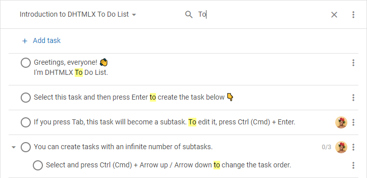
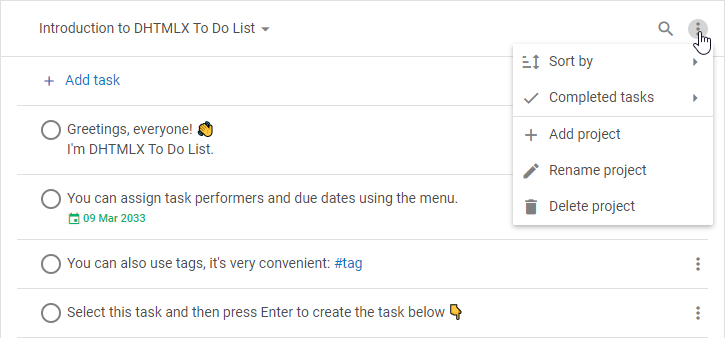
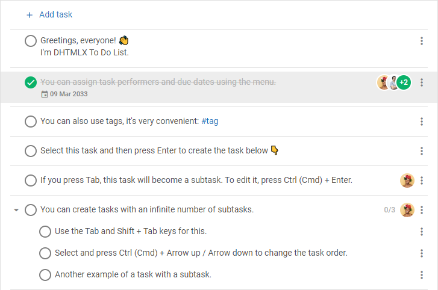
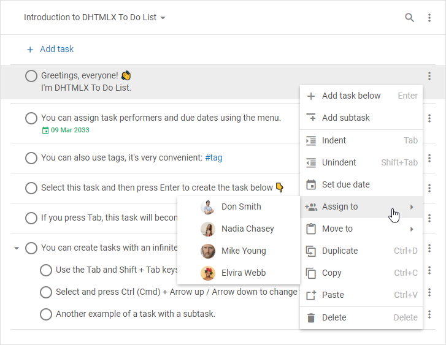

# DHTMLX To Do List overview

DHTMLX To Do List is an easy to use component for maintaining the tasks. The To Do List widget is a great planning tool that helps to achieve your goals and save the time. The component allows you to create infinite number of projects, add unlimited number of tasks and subtasks there, drag and drop tasks to change their order or priority level, and much more.

## To Do List structure

The interface of the To Do List component consists of two parts: [Toolbar](#toolbar) and [List](#list).

### Toolbar

**Toolbar** is a top part of the To Do List which includes:

- a **combo** control for switching between projects, and searching for the necessary project

- a **search bar** for searching for the needed tasks

- a **menu** for adding a new project, and renaming or deleting a currently active project

:::info
You can change the toolbar structure by adding custom elements or changing the order of the built-in controls. Read more in the [**Configuration**](guides/configuration.md#toolbar) and [**Customization**](guides/customization.md#toolbar) sections.
:::

### List

The **list of tasks** is the main part of the To Do List interface intended for adding new tasks, editing, or deleting the existing ones. You can easily configure the appearance of tasks. Read more in the [Configuration](guides/configuration.md) section. 

## Managing tasks

### Adding new tasks

- To add a new task into the beginning of the list, click on the **+ Add task** button in the top navigation panel

- To add a new task under the necessary one, select the task and press `Space`

- To add a subtask, add a new task under the selected one and press `Tab`. Use `Shift + Tab` to promote the nesting level of the task

- To copy a task, press `Ctrl (Cmd) + C`. To paste a task, press `Ctrl (Cmd) + V`
- To copy a task down, press `Ctrl (Cmd) + D`

### Editing tasks

- To edit a task, double-click on the task record in the list or press `Ctrl (Cmd) + Enter`. Then, make the changes and press `Enter`
> It is possible to enter text, numbers, hashtags, dates. For more details, read [Supported formats of data](guides/inline_editing.md#supported-formats-of-data).

- To mark a task as complete/incomplete, press `Space` or click on the checkbox to the left of the task

- To collapse/expand a task with subtasks, click on the arrow icon to the left of the task or press `Arrow Left`/ `Arrow Right`

- To set a due date for the task, open the task menu, select **Set due date** and choose the date via the date picker

- To change the due date of the task, click the due date shown in the task and choose the necessary date 

- To assign users to the task, open the task menu, hover **Assign to** and select the necessary users in the dropdown list. To unassign users from the task, unselect them in the dropdown list

### Moving tasks

- To move a task withing a project, select the task and press `Arrow Up`/ `Arrow Down`
- To move a task to another project, open the task menu, hover **Move to** and select the necessary project in the dropdown list

### Deleting tasks

- To delete a task, select the task and press `Backspace`/`Delete`

:::info
For more details about all available keyboard shortcuts, follow the [**reference**](api/events/keypressontodo_event.md#keyboard-shortcuts)
:::

## What's next

Once you have a short overview of To Do List you are ready to learn how to display the component on the page. Follow the directions given in the [How to start](how_to_start/) article. 