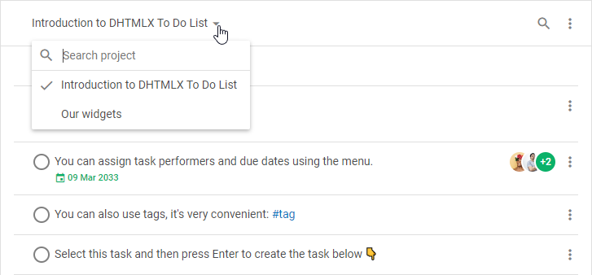
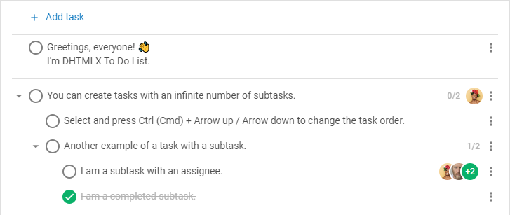

# DHTMLX To Do List overview

DHTMLX To Do List is an easy to use component for maintaining the tasks. The To Do List widget is a great planning tool that helps to achieve your goals and save the time. The component allows you to create infinite number of projects, add unlimited number of tasks and subtasks there, drag and drop tasks to change their order or priority level, and much more.

## To Do List structure

The interface of the To Do List component consists of two parts: [Toolbar](#toolbar) and [List](#list).

### Toolbar

**Toolbar** is a top part of the To Do List which includes:

- a **combo** control for switching between projects, and searching for the necessary project

- a **search bar** for searching for the needed tasks

- a **menu** with a set of controls which allow you to:
    - sort tasks in the ascending/descending order by the following criteria:
        - by text
        - by due date
        - by completion date
        - by creation date
        - by editing date
    - hide/show completed tasks
    - to add a new project, rename or delete a currently active project

:::info
You can change the toolbar structure by adding custom elements or changing the order of the built-in controls. Read more in the [**Configuration**](guides/configuration.md#toolbar) and [**Customization**](guides/customization.md#toolbar) sections.
:::

### List

The **list of tasks** is the main part of the To Do List interface intended for adding new tasks, editing, or deleting the existing ones. You can easily configure the appearance of tasks. Read more in the [Configuration](guides/configuration.md) section. 

## Selecting tasks

### Selecting one task

- To select a task just click on it

- To move selection up to the previous task, press `ArrowUp`

- To move selection down to the next task, press `ArrowDown`

### Selecting multiple tasks

- To select multiple tasks, you can apply the following combinations:
    - hold down the `Ctrl (Cmd)` key and click each task you'd like to select
    - hold down the `Ctrl (Cmd) + Shift` keys and click each task you'd like to select
    - click on the first task, hold down the `Shift` key, then click on the last task and release `Shift`
- To select a task above/below the current one, press `Shift` + `Arrow Up`/ `Arrow Down` 

:::info
You can select the tasks only if they are visible on the page, i.e. tasks which stay visible after the filtering process or after switching to the mode of hiding completed tasks.
:::

:::tip
Check [the list of operations you can perform over selected tasks](#managing-multiple-tasks)
:::

## Managing a task

### Adding a new task

- To add a new task into the beginning of the list, click on the **+ Add task** button in the top navigation panel

- To add a new task under the necessary one, select the task and press `Enter`

- To add a subtask, add a new task under the selected one and press `Tab`. Use `Shift + Tab` to promote the nesting level of the task

- To copy a task, click on it and press `Ctrl (Cmd) + C`. To paste a task, press `Ctrl (Cmd) + V`
- To copy a task down, click on it and press `Ctrl (Cmd) + D`
- To copy a task during drag-n-drop, press `Alt` while dragging-and-dropping it

### Editing a task

- To edit a task, double-click on the task record in the list or press `Ctrl (Cmd) + Enter`. Then, make the changes and press `Enter`
> It is possible to enter text, numbers, hashtags, dates. For more details, read [Supported formats of data](guides/inline_editing.md#supported-formats-of-data).

- To mark a task as complete/incomplete, click on the checkbox to the left of the task or press `Space`

- To collapse/expand a task with subtasks, click on the arrow icon to the left of the task or press `Arrow Left`/ `Arrow Right`

- To set a due date for the task, open the task menu, select **Set due date** and choose the date via the date picker

- To change the due date of the task, click the due date shown in the task and choose the necessary date 

- To assign people to the task, open the task menu, hover **Assign to** and select the necessary people in the dropdown list. To unassign people from the task, unselect them in the dropdown list

### Moving a task

- To move a task withing a project, select the task and press `Ctrl (Cmd)` + `Arrow Up`/ `Arrow Down` or use drag-n-drop
- To move a task to another project, open the task menu, hover **Move to** and select the necessary project in the dropdown list

### Deleting a task

- To delete a task, select it and press `Backspace`/`Delete`

## Managing multiple tasks

After you have selected [multiple tasks](#selecting-multiple-tasks), you can perform a set of operations over them, namely:

- to delete tasks by pressing `Backspace`/`Delete`
- to copy tasks via `Ctrl (Cmd) + C` and paste them via `Ctrl (Cmd) + V`. The tasks which are selected in the chaotic order will be structured depending on the structure of the data
- to copy tasks down via `Ctrl (Cmd) + D` 
- to drag-n-drop tasks
- to copy tasks via pressing `Alt` while dragging-and-dropping them
- to move tasks withing a project via `Ctrl (Cmd)` + `Arrow Up`/ `Arrow Down`
- to mark tasks as complete/incomplete by pressing `Space`
- to change the nesting level of tasks via `Tab`/ `Shift + Tab` 

:::note
The nesting level of the tasks which are selected with their parent will not change.
:::

:::info
Read the [**keyboard shortcuts**](api/events/keypressontodo_event.md#keyboard-shortcuts) section for more detail
:::

## What's next

Once you have a short overview of To Do List you are ready to learn how to display the component on the page. Follow the directions given in the [How to start](how_to_start/) article. 