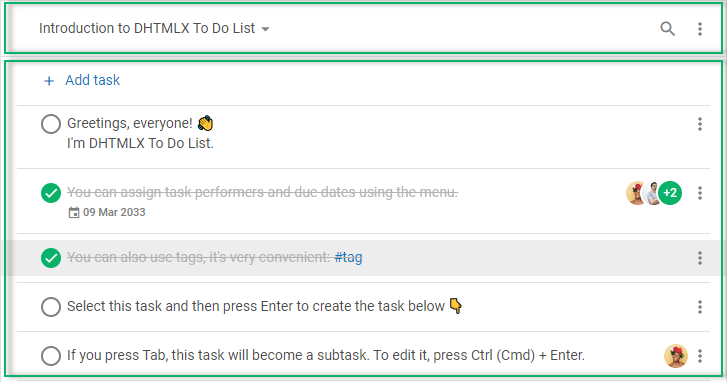

# DHTMLX To Do List overview

DHTMLX To Do List is an easy to use component for maintaining the tasks. To do list is a great planning tool that helps to achieve your goals and save the time. The component allows you to create infinite number of projects, add unlimited number of tasks and subtasks there, drag and drop tasks to change their order or priority level, and much more.

:::tip
There is a User Guide provided to make work with To Do List easy for your end users
:::

## To Do List structure

### Toolbar

#### Project menu

#### Search bar

### List

#### Task menu

## What's next

Once you have a short overview of To Do List you are ready to learn how to display the component on the page. Follow the directions given in the [How to start](how_to_start/) article. 