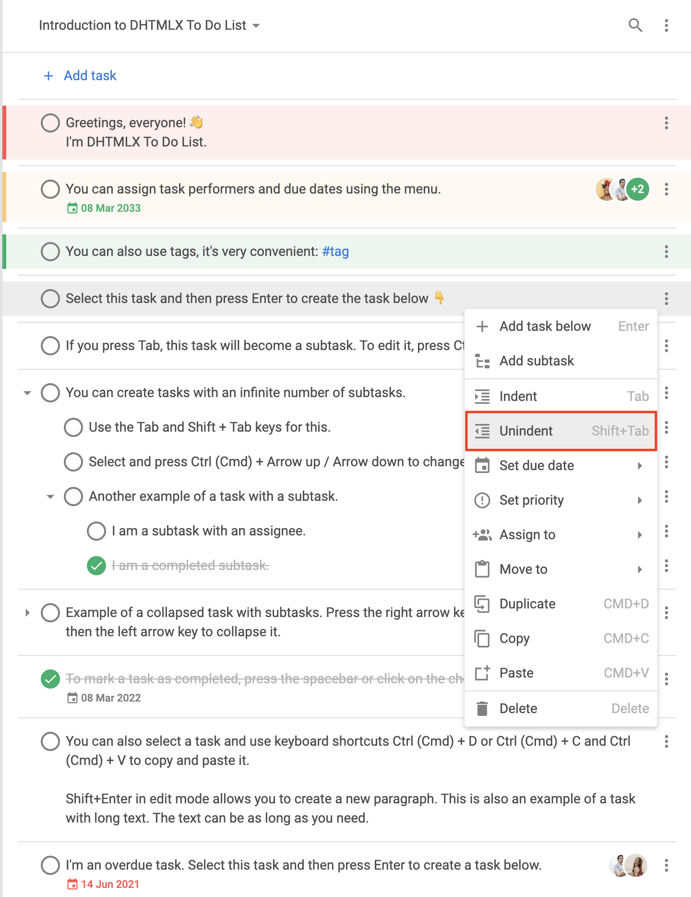
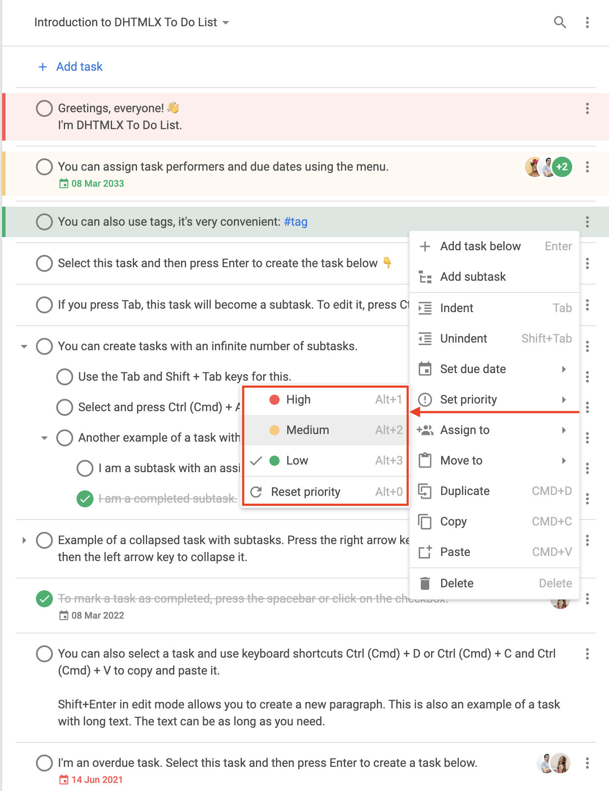

# menu

### Beschreibung {#description}

@short: Optional. Gibt die Sichtbarkeit des Kontextmenüs (als Boolean) oder Konfigurationsparameter (als Funktion) an

### Verwendung {#usage}

~~~js
menu?: boolean; 
// oder
menu?: function(config: object);
~~~

#### Kontextmenü anzeigen oder ausblenden {#show-or-hide-context-menu}

Wenn Sie das Kontextmenü *ausblenden* möchten, setzen Sie die Konfiguration `menu` auf `false`. Um das Standard-Kontextmenü anzuzeigen, setzen Sie die Konfiguration `menu` auf `true`.

~~~js
menu: true // Standard-Kontextmenü anzeigen

// oder

menu: false // Kontextmenü ausblenden
~~~

#### Kontextmenü anpassen {#modify-context-menu}

Wenn Sie ein Kontextmenü *anpassen* möchten, setzen Sie die Konfiguration `menu` auf einen Callback, der das Objekt `config` als Parameter erhält. Das Objekt `config` kann die folgende Struktur haben:

~~~js
config: {
    type: "user" | "toolbar" | "task",
    id?: string | number,
    source?: (string | number)[],
    store: object
};
~~~

**Parameter**

Das Objekt `config` kann die folgenden Parameter enthalten:

- `type` - (erforderlich) der Typ des Kontextmenüs. Hier können Sie einen der folgenden Werte angeben:
    - `"user"` - das Kontextmenü in Bezug auf Benutzer
    - `"toolbar"` - das Kontextmenü in Bezug auf die Toolbar
    - `"task"` - das Kontextmenü in Bezug auf Aufgaben
- `id` - (optional | erforderlich) die ID des Projekts. Dieser Parameter ist erforderlich, wenn `type: "toolbar"` gesetzt ist
- `source` - (optional | erforderlich) das Array mit den IDs der Aufgaben. Dieser Parameter ist erforderlich, wenn `type: "task"` gesetzt ist
- `store` - (erforderlich) der schreibgeschützte *DataStore*, der an die Methode `getMenuOptions()` übergeben werden soll

**Rückgabewert**

Der Callback sollte einen der folgenden Werte zurückgeben:

- `boolean` - `true`, um ein Standard-Kontextmenü anzuzeigen; `false`, um ein Kontextmenü auszublenden
- `object[]` - das Array von Objekten, die Daten für Kontextmenüeinträge speichern. Jedes Objekt kann die folgende Struktur haben:

    ~~~js
    {
        id: string | number,
        icon?: string,
        label?: string,
        hotkey?: string,
        value?: Date,
        data?: object[],
        handler?: function,
        css?: string,
        type?: string
    }
    ~~~

    - `id` - (erforderlich) die ID des Menüeintrags
    - `icon` - (optional) das Symbol für den Menüeintrag (standardmäßig aus der Schriftart `wxi`)
    - `label` - (optional) der Text für den Menüeintrag
    - `hotkey` - (optional) ein Tastenkürzel für die Aktion dieses Menüeintrags
    - `value` - (optional) das Fälligkeitsdatum, gültig für "datepicker"
    - `data` - (optional) das Array von Objekten, das Untereinträge des Menüeintrags speichert
    - `handler` - (optional) der Handler, mit dem Sie eine Aktion für einen benutzerdefinierten Menüeintrag ausführen können
    - `css` - (optional) die CSS-Klasse
    - `type` - (optional) der Typ des Menüeintrags. Hier können Sie die folgenden Typen angeben:
        - `"item"` - der grundlegende Menüeintrag

        

        
Standardstruktur des Typs `"item"`

            ~~~js {2}
            {
                type: "item",
                id: string,
                icon: string,
                label: string,
                hotkey: string,
                data: [ // falls erforderlich
                    // ... gleiche Objekte für Untereinträge
                ]
            }
            ~~~
            
        

        - `"separator"` - die Trennlinie zwischen Menüeinträgen

        

        
Standardstruktur des Typs `"separator"`

            ~~~js
            { type: "separator" }
            ~~~
        

        - `"priority"` - der Menüeintrag zum Festlegen von Prioritäten

        

        
Standardstruktur des Typs `"priority"`

        Standardmäßig werden im Untermenü des Eintrags `"setPriority"` die Einträge **Hoch**, **Mittel** und **Niedrig** angezeigt.

        ~~~js {2,10,18}
        {   // Hohe Priorität
            type: "priority",
            label: "High",
            color: "#ff5252",
            hotkey: "Alt+1",
            icon: "empty",
            id: "priority:1"
        },
        {   // Mittlere Priorität
            type: "priority",
            label: "Medium",
            color: "#ffc975",
            hotkey: "Alt+2",
            icon: "empty",
            id: "priority:2"
        },
        {   // Niedrige Priorität
            type: "priority",
            label: "Low",
            color: "#0ab169",
            hotkey: "Alt+3",
            icon: "empty",
            id: "priority:3"
        }
        ~~~

        
        

        - `"datepicker"` - der Menüeintrag zum Festlegen von Datumsangaben

        

        
Standardstruktur des Typs `"datepicker"`

        Standardmäßig wird der Eintrag `"datepicker"` im Untermenü des Eintrags `"setDate"` angezeigt.

        ~~~js {2}
        {
            type: "datepicker",
            id: "dueDate", // Standard-ID
            value: new Date(), // ausgewähltes Datum
            store: object // schreibgeschützt
        }
        ~~~

        
        

        - `"user"` - der Menüeintrag zum Zuweisen von Benutzern zu Aufgaben

        

        
Standardstruktur des Typs `"user"`

        ~~~js {2}
        {
            type: "user",
            id: string, 
            label: string,
            avatar: string, // der Pfad zum Benutzeravatar
            color: string, // die Farbe für den automatischen Avatar, falls kein Link zum Bild angegeben ist; Standardfarbe ist "#0AB169"
            icon: string, // das Symbol links neben dem Avatar, das den Benutzer als zugewiesen markiert
            clickable: boolean, // der Wert, der den Eintrag als anklickbar markiert
            checked: boolean // der Wert, der den durch diese Option repräsentierten Benutzer als zugewiesen markiert
        }
        ~~~

        
        

### Beispiel {#example}

~~~js {3-66,72}
const { ToDo, Toolbar, getMenuOptions } = todo;

const menu = function (config) {
    let options = getMenuOptions(config);

    const { source, store, type } = config;
    if (type === "task") {
        // nur einige der Standard-Menüoptionen beibehalten
        options = options.filter(o => {
            return (
                o.id == "addSubtask" ||
                o.id == "setDate" ||
                o.id == "setPriority" || 
                o.id == "assign"
            );
        });
        // neue Menüoptionen hinzufügen
        options.push({ type: "separator" });
        options.push({
            type: "item",
            icon: "calendar",
            label: "Add current date",
            id: "addDate",
            handler: () => {
                source.forEach(id => {
                    list.updateTask({
                        id,
                        task: {
                            due_date: new Date()
                        }
                    });
                });
            }
        });
        const task = store.getTask(source[0]);
        if (task.checked) {
            options.push({
                type: "item",
                icon: "undo",
                label: "Mark incomplete",
                id: "uncheck",
                handler: () => {
                    list.uncheckTask({
                        id
                    });
                }
            });
        } else {
            options.push({
                type: "item",
                icon: "check",
                label: "Complete",
                id: "check",
                handler: () => {
                    source.forEach(id => {
                        list.checkTask({
                            id
                        });
                    });
                }
            });
        }
    }

    return options;
};

new ToDo("#root", {
    tasks,
    users,
    projects,
    menu
});
~~~

**Änderungsprotokoll:** Die Konfiguration `menu` wurde in v1.3 hinzugefügt

**Verwandte Beispiele:**
    - [To-do-Liste. Menü-Anpassung. Optionen hinzufügen und entfernen](https://snippet.dhtmlx.com/slpjstbb)
    - [To-do-Liste. Menü-Anpassung. Benutzerdefinierte Symbole](https://snippet.dhtmlx.com/cmfqmg00)
    - [To-do-Liste. Menü für bestimmte Teile der Oberfläche entfernen](https://snippet.dhtmlx.com/5pnk7y0d)
