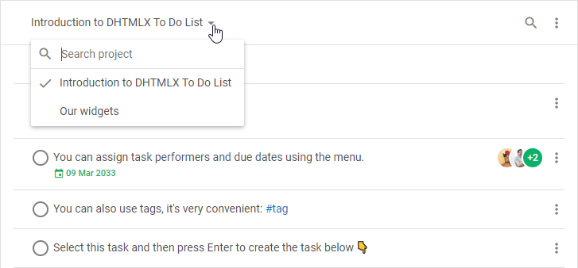
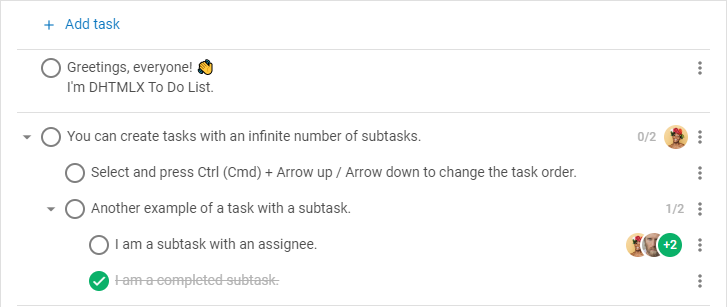
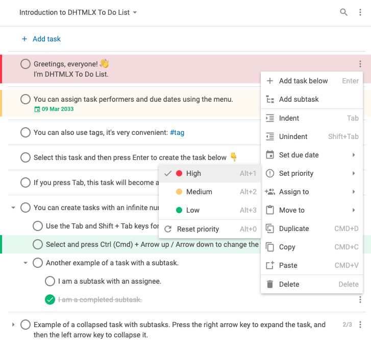
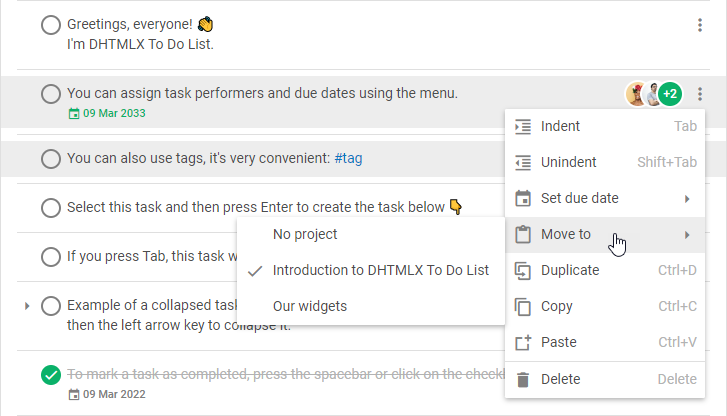

# DHTMLX To Do List – Übersicht {#dhtmlx-to-do-list-overview}

DHTMLX To Do List ist eine einfach zu bedienende Komponente zur Aufgabenverwaltung. Das To-Do-List-Widget ist ein praktisches Planungswerkzeug, das Ihnen hilft, Ihre Ziele zu erreichen und Zeit zu sparen. Die Komponente ermöglicht es Ihnen, beliebig viele Projekte zu erstellen, dort unbegrenzt viele Aufgaben und Unteraufgaben hinzuzufügen, Aufgaben per Drag-and-Drop in ihrer Reihenfolge oder Priorität zu verschieben und vieles mehr.

## Struktur von To Do List {#to-do-list-structure}

Die Oberfläche der To-Do-List-Komponente besteht aus zwei Teilen: [Toolbar](#toolbar) und [Liste](#list).

### Toolbar {#toolbar}

Die **Toolbar** ist der obere Teil von To Do List und enthält:

- ein **Combo**-Steuerelement zum Wechseln zwischen Projekten und zum Suchen nach dem gewünschten Projekt

- eine **Suchleiste** zum Suchen nach den benötigten Aufgaben

- ein **Menü** mit einer Reihe von Steuerelementen, mit denen Sie:
    - Aufgaben aufsteigend/absteigend nach folgenden Kriterien sortieren können:
        - nach Text
        - nach Priorität
        - nach Fälligkeitsdatum
        - nach Erledigungsdatum
        - nach Erstellungsdatum
        - nach Bearbeitungsdatum
    - erledigte Aufgaben aus- oder einblenden können
    - ein neues Projekt hinzufügen, das aktuell aktive Projekt umbenennen oder löschen können

:::info
Sie können die Toolbar-Struktur ändern, indem Sie benutzerdefinierte Elemente hinzufügen oder die Reihenfolge der integrierten Steuerelemente anpassen. Lesen Sie dazu die Abschnitte [**Konfiguration**](guides/configuration.md#toolbar) und [**Anpassung**](guides/customization.md#customize-the-toolbar).
:::

### Liste {#list}

Die **Aufgabenliste** ist der Hauptteil der To-Do-List-Oberfläche, mit dem Sie neue Aufgaben hinzufügen sowie vorhandene bearbeiten oder löschen können. Die Darstellung der Aufgaben lässt sich einfach konfigurieren. Lesen Sie dazu den Abschnitt [Konfiguration](guides/configuration.md). 

## Aufgaben auswählen {#selecting-tasks}

### Eine einzelne Aufgabe auswählen {#selecting-one-task}

- Um eine Aufgabe auszuwählen, klicken Sie einfach darauf
- Um die Auswahl zur vorherigen Aufgabe zu verschieben, drücken Sie `Arrow Up`
- Um die Auswahl zur nächsten Aufgabe zu verschieben, drücken Sie `Arrow Down`

### Mehrere Aufgaben auswählen {#selecting-multiple-tasks}

- Um mehrere Aufgaben auszuwählen, können Sie folgende Kombinationen verwenden:
    - Halten Sie die `Ctrl (Cmd)`-Taste gedrückt und klicken Sie auf jede gewünschte Aufgabe
    - Klicken Sie auf die erste Aufgabe, halten Sie die `Shift`-Taste gedrückt, klicken Sie dann auf die letzte Aufgabe und lassen Sie `Shift` los
- Um die Aufgabe ober- oder unterhalb der aktuellen auszuwählen, drücken Sie `Shift` + `Arrow Up`/`Arrow Down`

:::info
Sie können Aufgaben nur auswählen, wenn sie auf der Seite sichtbar sind, d. h. Aufgaben, die nach dem Filtern oder nach dem Wechsel in den Modus zum Ausblenden erledigter Aufgaben noch angezeigt werden.
:::

:::tip
Sehen Sie sich [die Liste der Operationen an, die Sie mit ausgewählten Aufgaben durchführen können](#managing-multiple-tasks)
:::

## Eine Aufgabe verwalten {#managing-a-task}

Sie können die ausgewählte Aufgabe sowohl über das Kontextmenü als auch per Tastaturnavigation verwalten.

### Kontextmenü {#context-menu}

Das **Kontextmenü** einer Aufgabe enthält eine Reihe von Einträgen und Untereinträgen und sieht folgendermaßen aus:

### Eine neue Aufgabe hinzufügen {#adding-a-new-task}

- Um eine neue Aufgabe am Anfang der Liste hinzuzufügen, klicken Sie auf die Schaltfläche **+ Aufgabe hinzufügen** in der oberen Navigationsleiste
- Um eine neue Aufgabe unterhalb einer vorhandenen hinzuzufügen, wählen Sie die Aufgabe aus und drücken Sie `Enter`
- Um eine Unteraufgabe hinzuzufügen, fügen Sie eine neue Aufgabe unter der ausgewählten ein und drücken Sie `Tab`. Mit `Shift + Tab` erhöhen Sie die Einrückungsebene der Aufgabe wieder
- Um eine Aufgabe zu kopieren, klicken Sie darauf und drücken Sie `Ctrl (Cmd) + C`. Zum Einfügen drücken Sie `Ctrl (Cmd) + V`
- Um eine Aufgabe nach unten zu kopieren, klicken Sie darauf und drücken Sie `Ctrl (Cmd) + D`
- Um eine Aufgabe beim Drag-and-Drop zu kopieren, halten Sie beim Ziehen `Alt` gedrückt

### Eine Aufgabe bearbeiten {#editing-a-task}

- Um eine Aufgabe zu bearbeiten, doppelklicken Sie auf den Aufgabeneintrag in der Liste oder drücken Sie `Ctrl (Cmd) + Enter`. Nehmen Sie dann die Änderungen vor und drücken Sie `Enter`
> Es ist möglich, Text, Zahlen, Hashtags und Datumsangaben einzugeben. Weitere Details finden Sie unter [Unterstützte Datenformate](guides/inline_editing.md#supported-formats-of-data).

- Um eine Aufgabe als erledigt/nicht erledigt zu markieren, klicken Sie auf das Kontrollkästchen links neben der Aufgabe oder drücken Sie `Space`
- Um eine Aufgabe mit Unteraufgaben ein-/auszuklappen, klicken Sie auf das Pfeil-Symbol links neben der Aufgabe oder drücken Sie `Arrow Left`/`Arrow Right`
- Um ein Fälligkeitsdatum für die Aufgabe festzulegen, öffnen Sie das Aufgabenmenü, wählen Sie **Fälligkeitsdatum festlegen** und wählen Sie das Datum über den Datumsauswähler
- Um das Fälligkeitsdatum einer Aufgabe zu ändern, klicken Sie auf das angezeigte Fälligkeitsdatum und wählen Sie das gewünschte Datum
- Um Personen einer Aufgabe zuzuweisen, öffnen Sie das Aufgabenmenü, zeigen Sie auf **Zuweisen an** und wählen Sie die gewünschten Personen in der Dropdown-Liste aus. Um die Zuweisung von Personen aufzuheben, heben Sie die Auswahl in der Dropdown-Liste auf

### Eine Aufgabe verschieben {#moving-a-task}

- Um eine Aufgabe innerhalb eines Projekts zu verschieben, wählen Sie die Aufgabe aus und drücken Sie `Ctrl (Cmd)` + `Arrow Up`/`Arrow Down` oder verwenden Sie Drag-and-Drop
- Um die Einrückungsebene einer Aufgabe zu senken/erhöhen, wählen Sie die Aufgabe aus und drücken Sie `Tab`/`Shift + Tab`
- Um eine Aufgabe in ein anderes Projekt zu verschieben, öffnen Sie das Aufgabenmenü, zeigen Sie auf **Verschieben nach** und wählen Sie das gewünschte Projekt in der Dropdown-Liste aus

### Eine Aufgabe löschen {#deleting-a-task}

- Um eine Aufgabe zu löschen, wählen Sie sie aus und drücken Sie `Backspace`/`Delete`

### Eine Aufgabe priorisieren {#prioritizing-a-task}

- Um die Priorität **Hoch** festzulegen, wählen Sie die Aufgabe aus und drücken Sie `Alt + 1`
- Um die Priorität **Mittel** festzulegen, wählen Sie die Aufgabe aus und drücken Sie `Alt + 2`
- Um die Priorität **Niedrig** festzulegen, wählen Sie die Aufgabe aus und drücken Sie `Alt + 3`
- Um die Priorität **zurückzusetzen**, wählen Sie die Aufgabe aus und drücken Sie `Alt + 0`

## Mehrere Aufgaben verwalten {#managing-multiple-tasks}

Nachdem Sie [mehrere Aufgaben](#selecting-multiple-tasks) ausgewählt haben, können Sie eine Reihe von Operationen darauf ausführen:

- ein **Kontextmenü** für die ausgewählten Aufgaben öffnen

- Aufgaben durch Drücken von `Backspace`/`Delete` löschen
- Aufgaben per `Ctrl (Cmd) + C` kopieren und per `Ctrl (Cmd) + V` einfügen. Aufgaben, die in beliebiger Reihenfolge ausgewählt wurden, werden entsprechend der Datenstruktur geordnet
- Aufgaben per `Ctrl (Cmd) + D` nach unten kopieren
- Aufgaben per Drag-and-Drop verschieben
- Aufgaben durch Gedrückthalten von `Alt` beim Drag-and-Drop kopieren
- Aufgaben innerhalb eines Projekts per `Ctrl (Cmd)` + `Arrow Up`/`Arrow Down` verschieben
- die Einrückungsebene von Aufgaben per `Tab`/`Shift + Tab` senken/erhöhen. Beachten Sie, dass sich die Einrückungsebene von Aufgaben, die zusammen mit ihrer übergeordneten Aufgabe ausgewählt wurden, nicht ändert
- Aufgaben durch Drücken von `Space` als erledigt/nicht erledigt markieren

:::info
Weitere Details finden Sie im Abschnitt [**Tastaturkürzel**](api/events/keypressontodo_event.md#keyboard-shortcuts)
:::

## Nächste Schritte {#whats-next}

Nachdem Sie sich einen kurzen Überblick über To Do List verschafft haben, können Sie nun lernen, die Komponente auf der Seite anzuzeigen. Folgen Sie den Anweisungen im Artikel [Erste Schritte](how_to_start.md).
