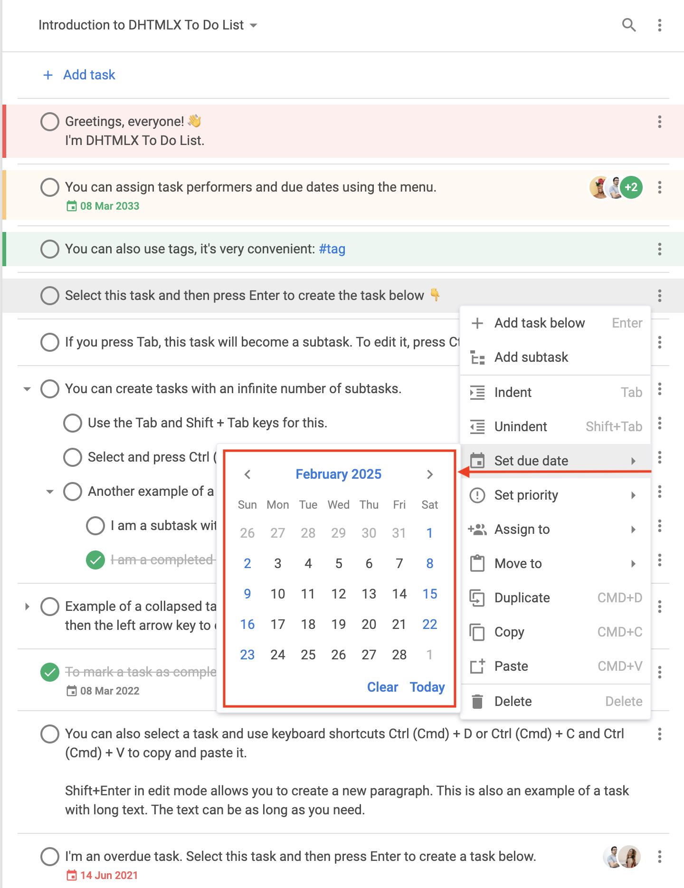

# menu

### 설명 {#description}

@short: 선택 사항. 컨텍스트 메뉴 표시 여부(boolean인 경우) 또는 구성 파라미터(function인 경우)를 지정합니다

### 사용법 {#usage}

~~~js
menu?: boolean; 
// or
menu?: function(config: object);
~~~

#### 컨텍스트 메뉴 표시 또는 숨기기 {#show-or-hide-context-menu}

컨텍스트 메뉴를 *숨기려면* `menu` config를 `false`로 설정합니다. 기본 컨텍스트 메뉴를 표시하려면 `menu` config를 `true`로 설정합니다.

~~~js
menu: true // 기본 컨텍스트 메뉴를 표시합니다

// or

menu: false // 컨텍스트 메뉴를 숨깁니다
~~~

#### 컨텍스트 메뉴 수정 {#modify-context-menu}

컨텍스트 메뉴를 *수정*하려면 `menu` config를 `config` 객체를 파라미터로 받는 콜백으로 설정합니다. `config` 객체는 다음 구조를 가질 수 있습니다:

~~~js
config: {
    type: "user" | "toolbar" | "task",
    id?: string | number,
    source?: (string | number)[],
    store: object
};
~~~

**파라미터**

`config` 객체는 다음 파라미터를 포함할 수 있습니다:

- `type` - (필수) 컨텍스트 메뉴의 유형. 다음 값 중 하나를 지정할 수 있습니다:
    - `"user"` - 사용자 관련 컨텍스트 메뉴
    - `"toolbar"` - toolbar 관련 컨텍스트 메뉴
    - `"task"` - 작업 관련 컨텍스트 메뉴
- `id` - (선택 사항 | 필수) 프로젝트의 ID. `type: "toolbar"`인 경우 이 파라미터는 필수입니다
- `source` - (선택 사항 | 필수) 작업 ID를 포함하는 배열. `type: "task"`인 경우 이 파라미터는 필수입니다
- `store` - (필수) `getMenuOptions()` 메서드에 전달되어야 하는 읽기 전용 *DataStore*

**반환값**

콜백은 다음 값 중 하나를 반환해야 합니다:

- `boolean` - 기본 컨텍스트 메뉴를 표시하려면 `true`, 컨텍스트 메뉴를 숨기려면 `false`
- `object[]` - 컨텍스트 메뉴 항목 데이터를 저장하는 객체 배열. 각 객체는 다음 구조를 가질 수 있습니다:

    ~~~js
    {
        id: string | number,
        icon?: string,
        label?: string,
        hotkey?: string,
        value?: Date,
        data?: object[],
        handler?: function,
        css?: string,
        type?: string
    }
    ~~~

    - `id` - (필수) 메뉴 항목의 ID
    - `icon` - (선택 사항) 메뉴 항목의 아이콘 (기본적으로 `wxi` 폰트에서 가져옵니다)
    - `label` - (선택 사항) 메뉴 항목의 텍스트
    - `hotkey` - (선택 사항) 해당 메뉴 항목 동작의 단축키
    - `value` - (선택 사항) 마감일. "datepicker"에 유효합니다
    - `data` - (선택 사항) 메뉴 항목의 하위 항목을 저장하는 객체 배열
    - `handler` - (선택 사항) 사용자 정의 메뉴 항목의 동작을 수행하는 핸들러
    - `css` - (선택 사항) CSS 클래스
    - `type` - (선택 사항) 메뉴 항목 유형. 다음 유형을 지정할 수 있습니다:
        - `"item"` - 기본 메뉴 항목

        

        
`"item"` 유형의 기본 구조

            ~~~js {2}
            {
                type: "item",
                id: string,
                icon: string,
                label: string,
                hotkey: string,
                data: [ // if required
                    // ... same objects for sub-items
                ]
            }
            ~~~
            
        

        - `"separator"` - 메뉴 항목을 구분하는 선

        

        
`"separator"` 유형의 기본 구조

            ~~~js
            { type: "separator" }
            ~~~
        

        - `"priority"` - 우선순위 설정을 위한 메뉴 항목

        

        
`"priority"` 유형의 기본 구조

        기본적으로 `"setPriority"` 항목의 하위 메뉴에는 **High**, **Medium**, **Low** 항목이 표시됩니다.

        ~~~js {2,10,18}
        {   // High priority
            type: "priority",
            label: "High",
            color: "#ff5252",
            hotkey: "Alt+1",
            icon: "empty",
            id: "priority:1"
        },
        {   // Medium priority
            type: "priority",
            label: "Medium",
            color: "#ffc975",
            hotkey: "Alt+2",
            icon: "empty",
            id: "priority:2"
        },
        {   // Low priority
            type: "priority",
            label: "Low",
            color: "#0ab169",
            hotkey: "Alt+3",
            icon: "empty",
            id: "priority:3"
        }
        ~~~

        
        

        - `"datepicker"` - 날짜 설정을 위한 메뉴 항목

        

        
`"datepicker"` 유형의 기본 구조

        기본적으로 `"datepicker"` 항목은 `"setDate"` 항목의 하위 메뉴에 표시됩니다.

        ~~~js {2}
        {
            type: "datepicker",
            id: "dueDate", // default ID
            value: new Date(), // selected date
            store: object // readonly
        }
        ~~~

        
        

        - `"user"` - 작업에 사용자를 할당하기 위한 메뉴 항목

        

        
`"user"` 유형의 기본 구조

        ~~~js {2}
        {
            type: "user",
            id: string, 
            label: string,
            avatar: string, // the path to the user avatar
            color: string, // the color for the automatic avatar if the link to the picture is not provided, default color is "#0AB169"
            icon: string, // the icon displayed to the left of the avatar and marks the user as assigned
            clickable: boolean, // the value that marks the item as clickable
            checked: boolean // the value that marks the user that this option represents as assigned
        }
        ~~~

        
        

### 예제 {#example}

~~~js {3-66,72}
const { ToDo, Toolbar, getMenuOptions } = todo;

const menu = function (config) {
    let options = getMenuOptions(config);

    const { source, store, type } = config;
    if (type === "task") {
        // leaving only some of the default menu options
        options = options.filter(o => {
            return (
                o.id == "addSubtask" ||
                o.id == "setDate" ||
                o.id == "setPriority" || 
                o.id == "assign"
            );
        });
        // adding new menu options
        options.push({ type: "separator" });
        options.push({
            type: "item",
            icon: "calendar",
            label: "Add current date",
            id: "addDate",
            handler: () => {
                source.forEach(id => {
                    list.updateTask({
                        id,
                        task: {
                            due_date: new Date()
                        }
                    });
                });
            }
        });
        const task = store.getTask(source[0]);
        if (task.checked) {
            options.push({
                type: "item",
                icon: "undo",
                label: "Mark incomplete",
                id: "uncheck",
                handler: () => {
                    list.uncheckTask({
                        id
                    });
                }
            });
        } else {
            options.push({
                type: "item",
                icon: "check",
                label: "Complete",
                id: "check",
                handler: () => {
                    source.forEach(id => {
                        list.checkTask({
                            id
                        });
                    });
                }
            });
        }
    }

    return options;
};

new ToDo("#root", {
    tasks,
    users,
    projects,
    menu
});
~~~

**변경 이력**: `menu` config는 v1.3에서 추가되었습니다

**관련 예제**:
    - [To do list. 메뉴 커스터마이징. 옵션 추가 및 제거](https://snippet.dhtmlx.com/slpjstbb)
    - [To do list. 메뉴 커스터마이징. 사용자 정의 아이콘](https://snippet.dhtmlx.com/cmfqmg00)
    - [To do list. 인터페이스 특정 영역에서 메뉴 제거](https://snippet.dhtmlx.com/5pnk7y0d)
