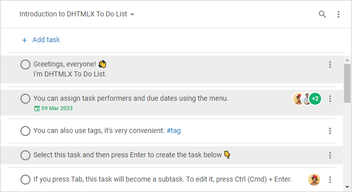

# 다중 선택 및 일괄 작업 {#multiple-select-and-bulk-operations}

To Do List 라이브러리를 사용하면 여러 태스크를 선택하고 한 번에 관리할 수 있습니다.

:::info
UI를 통해 [태스크를 선택](/#selecting-tasks)하고 [여러 태스크를 관리](/#managing-multiple-tasks)하는 방법을 알아보세요.
:::

## 초기 선택 태스크 {#initially-selected-tasks}

초기에 선택된 태스크가 있는 To Do List를 만들려면 [`selected`](api/configs/selected_config.md) 구성 속성을 사용하세요. 아래 예제는 초기화 시 세 개의 태스크를 미리 선택합니다:

~~~js {12}
const list = new ToDo("#root", {
    tasks: [
        { id: "1", text: "Task 1" },
        { id: "1.1", text: "Task 1.1", parent: "1" },
        { id: "1.1.1", text: "Task 1.1.1", parent: "1.1" },
        { id: "1.2", text: "Task 1.2", parent: "1" },
        { id: "2", text: "Task 2" },
        { id: "2.1", text: "Task 2.1", parent: "2" },
        { id: "2.1.1", text: "Task 2.1.1", parent: "2.1" },
        { id: "2.2", text: "Task 2.2", parent: "2" },
    ],
    selected: ["1.1", "1.2", "2.2"],
});

console.log(list.getSelection()); // ["1.1", "1.2", "2.2"]
~~~

## 태스크 선택 {#select-tasks}

초기화 이후 태스크를 선택하려면 [`selectTask()`](api/methods/selecttask_method.md) 메서드를 사용하세요. 이 메서드는 두 개의 파라미터를 받습니다:

- `id` — 선택할 태스크의 id
- `join` — 기존 선택에 태스크를 추가할지 여부

### 태스크 하나 선택 {#select-one-task}

기본적으로 `join` 파라미터는 `false`로 설정됩니다. 이 메서드는 지정된 태스크만 선택하고 이전에 선택된 태스크는 해제합니다.

아래 코드 조각은 현재 선택을 단일 태스크로 교체합니다:

~~~js {19}
const list = new ToDo("#root", {
    tasks: [
        { id: "1", text: "Task 1" },
        { id: "1.1", text: "Task 1.1", parent: "1" },
        { id: "1.1.1", text: "Task 1.1.1", parent: "1.1" },
        { id: "1.2", text: "Task 1.2", parent: "1" },
        { id: "2", text: "Task 2" },
        { id: "2.1", text: "Task 2.1", parent: "2" },
        { id: "2.1.1", text: "Task 2.1.1", parent: "2.1" },
        { id: "2.2", text: "Task 2.2", parent: "2" },
    ],
    selected: ["1.1", "1.2", "2.2"],
});

console.log(list.getSelection()) // ["1.1", "1.2", "2.2"]

list.selectTask({ 
    id: "2.1", 
    join: false // 이전에 선택된 태스크의 선택을 해제합니다
});

console.log(list.getSelection()) // ["2.1"]
~~~

### 여러 태스크 선택 {#select-multiple-tasks}

여러 태스크를 선택하려면 `join` 파라미터를 `true`로 설정하세요. 그러면 `selectTask()` 메서드가 지정된 태스크를 현재 선택에 추가합니다.

아래 예제는 루프를 사용하여 여러 태스크를 선택합니다:

~~~js {14-18}
const list = new ToDo("#root", {
    tasks: [
        { id: "1", text: "Task 1" },
        { id: "1.1", text: "Task 1.1", parent: "1" },
        { id: "1.1.1", text: "Task 1.1.1", parent: "1.1" },
        { id: "1.2", text: "Task 1.2", parent: "1" },
        { id: "2", text: "Task 2" },
        { id: "2.1", text: "Task 2.1", parent: "2" },
        { id: "2.1.1", text: "Task 2.1.1", parent: "2.1" },
        { id: "2.2", text: "Task 2.2", parent: "2" },
    ]
});

const selected = ["1.1", "1.2", "2.2"];

for (id of selected) {
    list.selectTask({ id, join: true });
}

console.log(list.getSelection()) // ["1.1", "1.2", "2.2"]
~~~

아래 코드 조각은 기존 선택에 태스크를 하나 더 추가합니다:

~~~js {3}
console.log(list.getSelection()) // ["1.1", "1.2", "2.2"]

list.selectTask({ id: "2.1", join: true });

console.log(list.getSelection()) // ["1.1", "1.2", "2.2", "2.1"]
~~~

## 선택된 태스크 전체 가져오기 {#get-all-selected-tasks}

현재 선택된 모든 태스크의 id를 가져오려면 [`getSelection()`](api/methods/getselection_method.md) 메서드를 사용하세요. 아래 예제는 정렬되지 않은 출력과 정렬된 출력의 차이를 보여줍니다:

~~~js
// 정렬 - 비활성화
list.getSelection({ sorted: false }); // ["1.2", "1.1", "2.2", "2.1"]

// 정렬 - 활성화
list.getSelection({ sorted: true }); // ["1.1", "1.2", "2.1", "2.2"]
~~~

`sorted` 파라미터를 활성화하면 선택된 태스크의 ID를 화면에 표시된 순서대로 가져올 수 있습니다.

## 선택된 태스크 관리 {#manage-selected-tasks}

여러 태스크를 선택한 후, 모든 태스크에 한 번에 작업을 적용할 수 있습니다.

라이브러리는 선택된 모든 태스크를 순회하기 위한 [`eachSelected()`](api/methods/eachselected_method.md) 메서드를 제공합니다. 이 메서드는 정렬과 반복 방향을 제어하는 추가 파라미터 `sorted` 및 `reversed`를 받습니다.

아래 예제는 선택된 모든 태스크를 삭제합니다:

~~~js
list.eachSelected(id => {
    list.deleteTask({ id });
}, true);
~~~

### 사용 가능한 작업 목록 {#list-of-available-operations}

API 메서드를 통해 선택된 여러 태스크에 대해 다음과 같은 일괄 작업을 수행할 수 있습니다:

- [`copyTask()`](api/methods/copytask_method.md) — 태스크 복사
- [`pasteTask()`](api/methods/pastetask_method.md) — 태스크 붙여넣기
- [`moveTask()`](api/methods/movetask_method.md) — 태스크 이동
- [`deleteTask()`](api/methods/deletetask_method.md) — 태스크 삭제
- [`checkTask()`](api/methods/checktask_method.md), [`uncheckTask()`](api/methods/unchecktask_method.md) — 태스크를 완료 또는 미완료로 표시
- [`indentTask()`](api/methods/indenttask_method.md), [`unindentTask()`](api/methods/unindenttask_method.md) — 태스크의 중첩 수준을 내리거나 올리기

## 선택 해제 {#reset-selection}

### 태스크 하나 선택 해제 {#unselect-one-task}

하나의 태스크에서 선택을 해제하려면 태스크 id를 [`unselectTask()`](api/methods/unselecttask_method.md) 메서드의 파라미터로 전달하세요. 아래 코드 조각은 단일 태스크의 선택을 해제합니다:

~~~js
list.unselectTask({ id: "1.1" });
~~~

### 모든 태스크 선택 해제 {#unselect-all-tasks}

현재 선택된 모든 태스크의 선택을 해제하려면 [`unselectTask()`](api/methods/unselecttask_method.md) 메서드에 `id: null`을 전달하세요:

~~~js
list.unselectTask({ id: null });
~~~

## 키보드 단축키 {#keyboard-shortcuts}

:::info
자세한 내용은 [**키보드 내비게이션**](guides/keyboard_navigation.md) 가이드를 참고하세요.
:::
