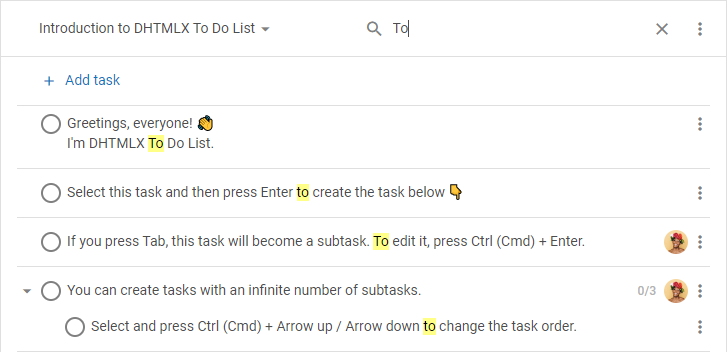
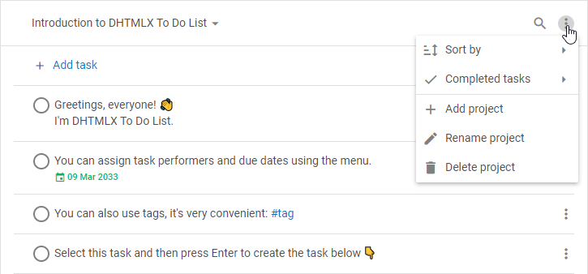

# DHTMLX To Do List 개요 {#dhtmlx-to-do-list-overview}

DHTMLX To Do List는 작업을 관리하기 위한 사용하기 쉬운 컴포넌트입니다. To Do List 위젯은 목표 달성과 시간 절약에 도움을 주는 훌륭한 계획 도구입니다. 이 컴포넌트를 사용하면 무한한 수의 프로젝트를 만들고, 거기에 제한 없이 작업과 하위 작업을 추가하며, 드래그 앤 드롭으로 작업의 순서나 우선순위를 변경하는 등 다양한 작업을 수행할 수 있습니다.

## To Do List 구조 {#to-do-list-structure}

To Do List 컴포넌트의 인터페이스는 [Toolbar](#toolbar)와 [List](#list) 두 부분으로 구성됩니다.

### Toolbar {#toolbar}

**Toolbar**는 To Do List의 상단 부분으로 다음을 포함합니다:

- 프로젝트 간 전환 및 필요한 프로젝트 검색을 위한 **콤보** 컨트롤

- 필요한 작업을 검색하기 위한 **검색 표시줄**

- 다음 작업을 수행할 수 있는 컨트롤 세트가 포함된 **메뉴**:
    - 다음 기준에 따라 작업을 오름차순/내림차순으로 정렬:
        - 텍스트 기준
        - 우선순위 기준
        - 마감일 기준
        - 완료 날짜 기준
        - 생성 날짜 기준
        - 편집 날짜 기준
    - 완료된 작업 숨기기/표시하기
    - 새 프로젝트 추가, 현재 활성 프로젝트 이름 바꾸기 또는 삭제하기

:::info
사용자 정의 요소를 추가하거나 내장 컨트롤의 순서를 변경하여 Toolbar 구조를 변경할 수 있습니다. 자세한 내용은 [**구성**](guides/configuration.md#toolbar) 및 [**커스터마이징**](guides/customization.md#customize-the-toolbar) 섹션을 참조하세요.
:::

### List {#list}

**작업 목록**은 새 작업 추가, 기존 작업 편집 또는 삭제를 위한 To Do List 인터페이스의 주요 부분입니다. 작업의 외관을 손쉽게 구성할 수 있습니다. 자세한 내용은 [구성](guides/configuration.md) 섹션을 참조하세요.

## 작업 선택 {#selecting-tasks}

### 단일 작업 선택 {#selecting-one-task}

- 작업을 선택하려면 해당 작업을 클릭하세요
- 이전 작업으로 선택을 이동하려면 `Arrow Up`을 누르세요
- 다음 작업으로 선택을 이동하려면 `Arrow Down`을 누르세요

### 여러 작업 선택 {#selecting-multiple-tasks}

- 여러 작업을 선택하려면 다음 조합을 사용할 수 있습니다:
    - `Ctrl (Cmd)` 키를 누른 상태에서 선택할 각 작업을 클릭합니다
    - 첫 번째 작업을 클릭하고 `Shift` 키를 누른 채 마지막 작업을 클릭한 후 `Shift`를 놓습니다
- 현재 작업의 위/아래 작업을 선택하려면 `Shift` + `Arrow Up`/`Arrow Down`을 누르세요

:::info
필터링 후 또는 완료된 작업 숨기기 모드로 전환한 후 페이지에 표시되는 작업만 선택할 수 있습니다.
:::

:::tip
[선택된 작업에 수행할 수 있는 작업 목록](#managing-multiple-tasks)을 확인하세요
:::

## 작업 관리 {#managing-a-task}

선택된 작업은 컨텍스트 메뉴 또는 키보드 탐색으로 관리할 수 있습니다.

### 컨텍스트 메뉴 {#context-menu}

작업의 **컨텍스트 메뉴**에는 항목 및 하위 항목 세트가 포함되어 있으며 다음과 같이 표시됩니다:

### 새 작업 추가 {#adding-a-new-task}

- 목록 맨 위에 새 작업을 추가하려면 상단 탐색 패널의 **+ 작업 추가** 버튼을 클릭합니다
- 선택된 작업 아래에 새 작업을 추가하려면 해당 작업을 선택하고 `Enter`를 누릅니다
- 하위 작업을 추가하려면 선택된 작업 아래에 새 작업을 추가하고 `Tab`을 누릅니다. `Shift + Tab`을 사용하면 작업의 들여쓰기 수준을 올릴 수 있습니다
- 작업을 복사하려면 해당 작업을 클릭하고 `Ctrl (Cmd) + C`를 누릅니다. 작업을 붙여넣으려면 `Ctrl (Cmd) + V`를 누릅니다
- 작업을 아래로 복사하려면 해당 작업을 클릭하고 `Ctrl (Cmd) + D`를 누릅니다
- 드래그 앤 드롭 중에 작업을 복사하려면 드래그하는 동안 `Alt`를 누릅니다

### 작업 편집 {#editing-a-task}

- 작업을 편집하려면 목록에서 작업 항목을 더블 클릭하거나 `Ctrl (Cmd) + Enter`를 누릅니다. 그런 다음 변경 사항을 적용하고 `Enter`를 누릅니다
> 텍스트, 숫자, 해시태그, 날짜를 입력할 수 있습니다. 자세한 내용은 [지원되는 데이터 형식](guides/inline_editing.md#supported-formats-of-data)을 참조하세요.

- 작업을 완료/미완료로 표시하려면 작업 왼쪽의 체크박스를 클릭하거나 `Space`를 누릅니다
- 하위 작업이 있는 작업을 접거나 펼치려면 작업 왼쪽의 화살표 아이콘을 클릭하거나 `Arrow Left`/`Arrow Right`를 누릅니다
- 작업에 마감일을 설정하려면 작업 메뉴를 열고 **마감일 설정**을 선택한 후 날짜 선택기에서 날짜를 선택합니다
- 작업의 마감일을 변경하려면 작업에 표시된 마감일을 클릭하고 필요한 날짜를 선택합니다
- 작업에 담당자를 지정하려면 작업 메뉴를 열고 **담당자 지정** 위에 마우스를 올린 후 드롭다운 목록에서 필요한 사람을 선택합니다. 작업에서 담당자를 해제하려면 드롭다운 목록에서 선택을 취소합니다

### 작업 이동 {#moving-a-task}

- 프로젝트 내에서 작업을 이동하려면 작업을 선택하고 `Ctrl (Cmd)` + `Arrow Up`/`Arrow Down`을 누르거나 드래그 앤 드롭을 사용합니다
- 작업의 들여쓰기 수준을 낮추거나 올리려면 작업을 선택하고 `Tab`/`Shift + Tab`을 누릅니다
- 작업을 다른 프로젝트로 이동하려면 작업 메뉴를 열고 **다음으로 이동** 위에 마우스를 올린 후 드롭다운 목록에서 필요한 프로젝트를 선택합니다

### 작업 삭제 {#deleting-a-task}

- 작업을 삭제하려면 해당 작업을 선택하고 `Backspace`/`Delete`를 누릅니다

### 작업 우선순위 설정 {#prioritizing-a-task}

- **높음** 우선순위를 설정하려면 작업을 선택하고 `Alt + 1`을 누릅니다
- **보통** 우선순위를 설정하려면 작업을 선택하고 `Alt + 2`를 누릅니다
- **낮음** 우선순위를 설정하려면 작업을 선택하고 `Alt + 3`을 누릅니다
- 우선순위를 **초기화**하려면 작업을 선택하고 `Alt + 0`을 누릅니다

## 여러 작업 관리 {#managing-multiple-tasks}

[여러 작업을 선택](#selecting-multiple-tasks)한 후 다음과 같은 작업을 수행할 수 있습니다:

- 선택된 작업에 대한 **컨텍스트 메뉴** 열기

- `Backspace`/`Delete`를 눌러 작업 삭제하기
- `Ctrl (Cmd) + C`로 작업 복사하고 `Ctrl (Cmd) + V`로 붙여넣기. 무작위 순서로 선택된 작업은 데이터 구조에 따라 정렬됩니다
- `Ctrl (Cmd) + D`로 작업 아래로 복사하기
- 작업 드래그 앤 드롭하기
- 드래그 앤 드롭 중 `Alt`를 누르면 작업 복사하기
- `Ctrl (Cmd)` + `Arrow Up`/`Arrow Down`으로 프로젝트 내에서 작업 이동하기
- `Tab`/`Shift + Tab`으로 작업의 들여쓰기 수준 낮추기/올리기. 부모 작업과 함께 선택된 작업의 들여쓰기 수준은 변경되지 않습니다
- `Space`를 눌러 작업을 완료/미완료로 표시하기

:::info
자세한 내용은 [**키보드 단축키**](api/events/keypressontodo_event.md#keyboard-shortcuts) 섹션을 참조하세요
:::

## 다음 단계 {#whats-next}

To Do List에 대한 간략한 개요를 확인하셨으면 이제 페이지에 컴포넌트를 표시하는 방법을 학습할 준비가 되었습니다. [시작하기](how_to_start.md) 문서에 나와 있는 안내를 따르세요.
