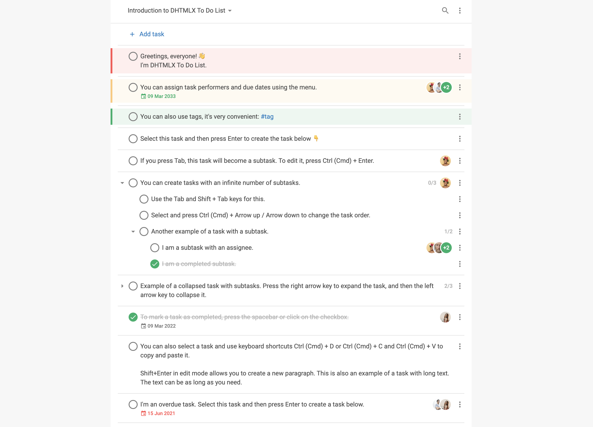

# Интеграция с Vue {#integration-with-vue}

:::tip
Прежде чем читать эту документацию, ознакомьтесь с базовыми концепциями и шаблонами [**Vue**](https://vuejs.org/). Для обновления знаний обратитесь к [**документации Vue 3**](https://vuejs.org/guide/introduction.html#getting-started).
:::

DHTMLX To Do List совместим с **Vue 3**. Приведённые ниже примеры показывают, как использовать их вместе. Полный проект доступен в [**примере на GitHub**](https://github.com/DHTMLX/vue-todolist-demo).

## Создание проекта {#create-a-project}

Создайте новый проект Vue и установите зависимости.

:::info
Перед созданием нового проекта установите [**Node.js**](https://nodejs.org/en/).
:::

Чтобы создать проект **Vue**, выполните следующую команду:

~~~bash
npm create vue@latest
~~~

Команда устанавливает и запускает `create-vue` — официальный инструмент создания проектов **Vue**. Подробности смотрите в [Быстром старте Vue.js](https://vuejs.org/guide/quick-start.html#creating-a-vue-application).

Назовите проект *my-vue-todo-app*.

### Установка зависимостей {#install-dependencies}

Перейдите в директорию приложения:

~~~bash
cd my-vue-todo-app
~~~

Установите зависимости и запустите сервер разработки с помощью менеджера пакетов.

Выполните следующие команды с [**yarn**](https://yarnpkg.com/):

~~~bash
yarn
yarn start
~~~

Выполните следующие команды с [**npm**](https://www.npmjs.com/):

~~~bash
npm install
npm run dev
~~~

Приложение запускается по адресу localhost (например, `http://localhost:3000`).

## Создание To Do List {#create-the-to-do-list}

Остановите приложение и установите пакет To Do List.

### Шаг 1. Установка пакета {#step-1-install-the-package}

Загрузите [**пробный пакет To Do List**](how_to_start.md#installing-to-do-list-via-npm-or-yarn) и следуйте инструкциям в файле README. Пробная версия доступна только 30 дней.

### Шаг 2. Создание компонента {#step-2-create-the-component}

Создайте Vue-компонент для добавления To Do List с Toolbar в приложение. В директории *src/components/* создайте новый файл *ToDo.vue*.

#### Импорт исходных файлов {#import-source-files}

Откройте *ToDo.vue* и импортируйте исходные файлы To Do List. Выберите один из двух путей импорта:

- PRO-версия, установленная из локальной папки — импорт из `dhx-todolist-package`
- пробная версия — импорт из `@dhx/trial-todolist`

Пример ниже импортирует из PRO-пакета:

~~~html title="ToDo.vue"

~~~

В зависимости от пакета исходные файлы могут быть минифицированы. В таком случае импортируйте CSS-файл как *todo.min.css*.

Следующий фрагмент импортирует из пробного пакета:

~~~html title="ToDo.vue"

~~~

В этом руководстве используется **пробная** версия.

#### Настройка контейнеров и добавление To Do List с Toolbar {#set-containers-and-add-the-to-do-list-with-toolbar}

Чтобы отобразить To Do List с Toolbar на странице, создайте контейнеры для обоих компонентов и инициализируйте их с помощью конструкторов. Пример ниже инициализирует компоненты внутри хука `mounted()`:

~~~html {2,7-8,10-14} title="ToDo.vue"

<template>
    

        

        

    

</template>
~~~

#### Загрузка данных {#load-data}

Создайте файл *data.js* в директории *src/* и добавьте в него данные. Следующий пример экспортирует функцию `getData()`, которая возвращает задачи, пользователей и проекты:

~~~jsx {2,19,28,38} title="data.js"
export function getData() {
    const tasks = [
        {
            id: "temp://1652991560212",
            project: "introduction",
            text: "Greetings, everyone! \u{1F44B} \nI'm DHTMLX To Do List.",
            priority: 1
        },
        {
            id: "1652374122964",
            project: "introduction",
            text: "You can assign task performers and due dates using the menu.",
            assigned: ["user_4", "user_1", "user_2", "user_3"],
            due_date: "2033-03-08T21:00:00.000Z",
            priority: 2
        },
        // ...
    ];
    const users = [
        {
            id: "user_1",
            label: "Don Smith",
            avatar:
                "https://snippet.dhtmlx.com/codebase/data/common/img/02/avatar_61.jpg"
        },
        // ...
    ];
    const projects = [
        {
            id: "introduction",
            label: "Introduction to DHTMLX To Do List"
        },
        {
            id: "widgets",
            label: "Our widgets"
        }
    ];
    return { tasks, users, projects };
}
~~~

Откройте *App.vue*, импортируйте данные и инициализируйте их через внутренний метод `data()`. Передайте данные в компонент `<ToDo/>` как **props**:

~~~html {3,7-14,19} title="App.vue"

<template>
    <ToDo :users="users" :tasks="tasks" :projects="projects" />
</template>
~~~

Перейдите в *ToDo.vue* и примените переданные **props** к объекту конфигурации To Do List. Фрагмент ниже передаёт данные пользователей, задач и проектов через конфигурацию:

~~~html {6,10-12} title="ToDo.vue"

<template>
    

        

        

    

</template>
~~~

Вы также можете использовать метод [`parse()`](api/methods/parse_method.md) внутри `mounted()` для загрузки данных в To Do List. Пример ниже загружает данные с помощью `parse()` после инициализации:

~~~html {6,16-20} title="ToDo.vue"

<template>
    

        

        

    

</template>
~~~

Каждый вызов `parse(data)` заменяет текущий набор данных.

Теперь компонент отображает заполненный To Do List. Другие доступные свойства описаны в [обзоре конфигурации](api/overview/configs_overview.md).

#### Обработка событий {#handle-events}

Подпишитесь на события, чтобы реагировать на действия пользователя. Смотрите [полный список событий](api/overview/events_overview.md).

Откройте *ToDo.vue* и дополните метод `mounted()`. Фрагмент ниже прикрепляет обработчик к событию `add-task`:

~~~html {8-10} title="ToDo.vue"

// ...
~~~

### Шаг 3. Добавление To Do List в приложение {#step-3-add-the-to-do-list-into-the-app}

Чтобы добавить компонент в приложение, откройте *App.vue* и замените код по умолчанию следующим фрагментом:

~~~html title="App.vue"

<template>
    <ToDo :users="users" :tasks="tasks" :projects="projects" />
</template>
~~~

Запустите приложение — To Do List отобразится с тестовыми данными:

Полный проект доступен на [**GitHub**](https://github.com/DHTMLX/vue-todolist-demo).
