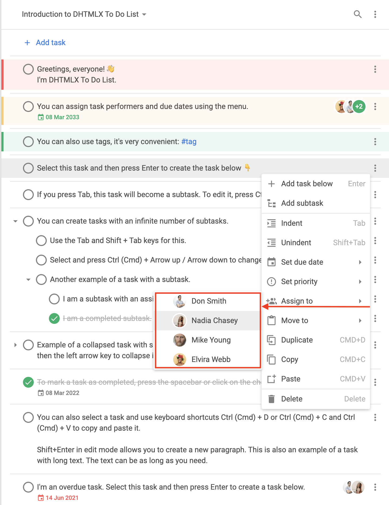

# menu

### 描述 {#description}

@short: 可选。指定右键菜单的显示状态（布尔值）或配置参数（函数）

### 用法 {#usage}

~~~js
menu?: boolean; 
// 或
menu?: function(config: object);
~~~

#### 显示或隐藏右键菜单 {#show-or-hide-context-menu}

若要*隐藏*右键菜单，将 `menu` 配置设置为 `false`。若要显示默认右键菜单，将 `menu` 配置设置为 `true`。

~~~js
menu: true // 显示默认右键菜单

// 或

menu: false // 隐藏右键菜单
~~~

#### 修改右键菜单 {#modify-context-menu}

若要*修改*右键菜单，将 `menu` 配置设置为一个接收 `config` 对象作为参数的回调函数。`config` 对象的结构如下：

~~~js
config: {
    type: "user" | "toolbar" | "task",
    id?: string | number,
    source?: (string | number)[],
    store: object
};
~~~

**参数**

`config` 对象可包含以下参数：

- `type` - （必填）右键菜单的类型。可指定以下值之一：
    - `"user"` - 与用户相关的右键菜单
    - `"toolbar"` - 与工具栏相关的右键菜单
    - `"task"` - 与任务相关的右键菜单
- `id` - （可选 | 必填）项目的 ID。当 `type: "toolbar"` 时此参数为必填
- `source` - （可选 | 必填）包含任务 ID 的数组。当 `type: "task"` 时此参数为必填
- `store` - （必填）只读的 *DataStore*，需传入 `getMenuOptions()` 方法

**返回值**

回调函数应返回以下值之一：

- `boolean` - `true` 表示显示默认右键菜单；`false` 表示隐藏右键菜单
- `object[]` - 存储右键菜单项数据的对象数组。每个对象的结构如下：

    ~~~js
    {
        id: string | number,
        icon?: string,
        label?: string,
        hotkey?: string,
        value?: Date,
        data?: object[],
        handler?: function,
        css?: string,
        type?: string
    }
    ~~~

    - `id` - （必填）菜单项的 ID
    - `icon` - （可选）菜单项的图标（默认来自 `wxi` 字体）
    - `label` - （可选）菜单项的文本
    - `hotkey` - （可选）该菜单项对应操作的快捷键
    - `value` - （可选）截止日期，适用于 `"datepicker"` 类型
    - `data` - （可选）存储菜单项子项数据的对象数组
    - `handler` - （可选）处理函数，用于对自定义菜单项执行相应操作
    - `css` - （可选）CSS 类名
    - `type` - （可选）菜单项类型。可指定以下类型：
        - `"item"` - 基本菜单项

        

        
`"item"` 类型的默认结构

            ~~~js {2}
            {
                type: "item",
                id: string,
                icon: string,
                label: string,
                hotkey: string,
                data: [ // 如需要
                    // ... 子项的相同对象结构
                ]
            }
            ~~~
            
        

        - `"separator"` - 用于分隔菜单项的分割线

        

        
`"separator"` 类型的默认结构

            ~~~js
            { type: "separator" }
            ~~~
        

        - `"priority"` - 用于设置优先级的菜单项

        

        
`"priority"` 类型的默认结构

        默认情况下，`"setPriority"` 子菜单中显示**高**、**中**、**低**三个选项。

        ~~~js {2,10,18}
        {   // 高优先级
            type: "priority",
            label: "High",
            color: "#ff5252",
            hotkey: "Alt+1",
            icon: "empty",
            id: "priority:1"
        },
        {   // 中优先级
            type: "priority",
            label: "Medium",
            color: "#ffc975",
            hotkey: "Alt+2",
            icon: "empty",
            id: "priority:2"
        },
        {   // 低优先级
            type: "priority",
            label: "Low",
            color: "#0ab169",
            hotkey: "Alt+3",
            icon: "empty",
            id: "priority:3"
        }
        ~~~

        
        

        - `"datepicker"` - 用于设置日期的菜单项

        

        
`"datepicker"` 类型的默认结构

        默认情况下，`"datepicker"` 项显示在 `"setDate"` 子菜单中。

        ~~~js {2}
        {
            type: "datepicker",
            id: "dueDate", // 默认 ID
            value: new Date(), // 选中的日期
            store: object // 只读
        }
        ~~~

        
        

        - `"user"` - 用于为任务分配用户的菜单项

        

        
`"user"` 类型的默认结构

        ~~~js {2}
        {
            type: "user",
            id: string, 
            label: string,
            avatar: string, // 用户头像的路径
            color: string, // 未提供图片链接时自动头像的颜色，默认颜色为 "#0AB169"
            icon: string, // 显示在头像左侧、标记用户已分配的图标
            clickable: boolean, // 将该项标记为可点击的值
            checked: boolean // 将该选项代表的用户标记为已分配的值
        }
        ~~~

        
        

### 示例 {#example}

~~~js {3-66,72}
const { ToDo, Toolbar, getMenuOptions } = todo;

const menu = function (config) {
    let options = getMenuOptions(config);

    const { source, store, type } = config;
    if (type === "task") {
        // 仅保留部分默认菜单选项
        options = options.filter(o => {
            return (
                o.id == "addSubtask" ||
                o.id == "setDate" ||
                o.id == "setPriority" || 
                o.id == "assign"
            );
        });
        // 添加新的菜单选项
        options.push({ type: "separator" });
        options.push({
            type: "item",
            icon: "calendar",
            label: "Add current date",
            id: "addDate",
            handler: () => {
                source.forEach(id => {
                    list.updateTask({
                        id,
                        task: {
                            due_date: new Date()
                        }
                    });
                });
            }
        });
        const task = store.getTask(source[0]);
        if (task.checked) {
            options.push({
                type: "item",
                icon: "undo",
                label: "Mark incomplete",
                id: "uncheck",
                handler: () => {
                    list.uncheckTask({
                        id
                    });
                }
            });
        } else {
            options.push({
                type: "item",
                icon: "check",
                label: "Complete",
                id: "check",
                handler: () => {
                    source.forEach(id => {
                        list.checkTask({
                            id
                        });
                    });
                }
            });
        }
    }

    return options;
};

new ToDo("#root", {
    tasks,
    users,
    projects,
    menu
});
~~~

**更新日志：** `menu` 配置在 v1.3 中新增

**相关示例：**
    - [To do list. 菜单自定义：添加和删除选项](https://snippet.dhtmlx.com/slpjstbb)
    - [To do list. 菜单自定义：自定义图标](https://snippet.dhtmlx.com/cmfqmg00)
    - [To do list. 为特定界面部分移除菜单](https://snippet.dhtmlx.com/5pnk7y0d)
